---
hide:
  - footer
---

# Montaje y mantenimiento de sistemas informáticos

El objetivo de este tema es servir de introducción al resto de contenidos de este wikilibro. Además se describen los componentes electrónicos y funcionales del ordenador que sirven de base para el resto de unidades y no se tratan en ellas. Después de leer el tema se deberían conocer y entender los siguientes puntos y diferecias entre:

- software y hardware.
- firmware y driver de cada dispositivo.
- jerarquías de la memoria y sus funciones.
- tipos de arquitecturas.

## 📒 Vocabulario

??? INFO "Boot"
    La secuencia de arranque, (boot o booting en inglés) es el proceso que inicia el sistema operativo cuando el usuario enciende una computadora. Se encarga de la inicialización del sistema y de los dispositivos.

??? INFO "DMA"
    El acceso directo a memoria (DMA, del inglés direct memory access) permite a cierto tipo de componentes de una computadora acceder a la memoria del sistema para leer o escribir independientemente de la unidad central de procesamiento (CPU) principal.

??? INFO "IRQ"
    Interrupción (también conocida como interrupción de hardware o petición de interrupción) es una señal recibida por el procesador de un computador, indicando que debe "interrumpir" el curso de ejecución actual y pasar a ejecutar código específico para tratar esta situación.

??? INFO "Plug-and-play o PnP"
    _**"enchufar y usar"**_ es la tecnología que permite a un dispositivo informático ser conectado a una computadora sin tener que configurar mediante jumpers. El sistema operativo con el que funciona el computador debe tener soporte para dicho dispositivo. Plug-and-play no significa que no sea necesario instalar drivers de dispositivos adicionales para el correcto funcionamiento del dispositivo. Esto es, Plug and Play NO es sinónimo de "no necesita drivers". Durante el inicio, las tarjetas de la familia PCI y USB interactúan y negocian los recursos solicitados con el sistema. Esto permite asignación de IRQs.

??? INFO "Núcleo o kernel"
    Es un software que constituye la parte más importante del sistema operativo. Es el principal responsable de facilitar a los distintos programas acceso seguro al hardware de la computadora o en forma básica, es el encargado de gestionar recursos, a través de servicios de llamada al sistema.

??? INFO "Tasa de transferencia (_Bit rate_)"
    Tasa de Transferencia o tasa de bits (en inglés bit rate) define el número de bits que se transmiten por unidad de tiempo a través de un sistema de transmisión digital o entre dos dispositivos digitales. Así pues, es la velocidad de transferencia de datos.

??? INFO "Semiconductor"
    Es un elemento que se comporta como un conductor o como aislante eléctrico dependiendo de diversos factores, como por ejemplo el campo eléctrico o magnético, la presión, la radiación que le incide, o la temperatura del ambiente en el que se encuentre.

??? INFO "Volátil"
    Es una propiedad de inconsistencia que tienen algunos dispositivos a perder la información almacenada en ellos cuando se deja de suministrar energía eléctrica. Se aplica a la memoria RAM.

## 💻 Sistema informático

<figure markdown>
  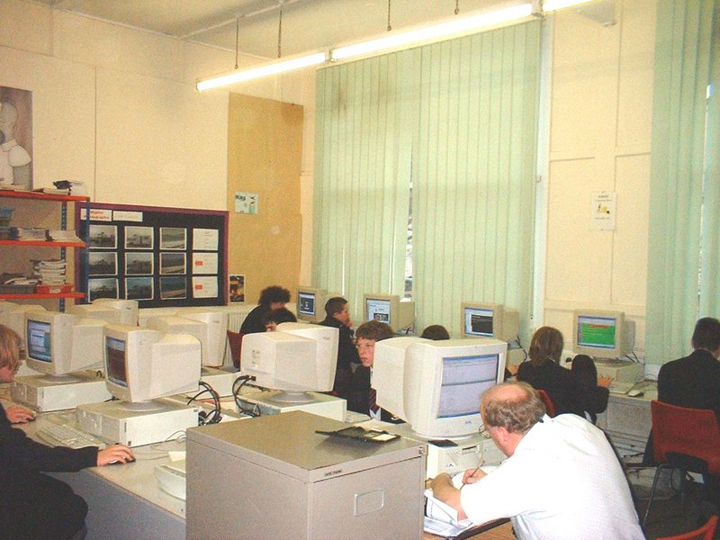{ width="400" }
  <figcaption></figcaption>
</figure>

Un sistema informático, como todo sistema, es el conjunto de partes interrelacionadas, hardware, software y de recurso humano que permite almacenar y procesar información.

El **hardware** incluye computadoras o cualquier tipo de dispositivo electrónico, que consisten en procesadores, memoria, sistemas de almacenamiento externo, etc (son tangibles, se pueden tocar).

El **software** incluye al sistema operativo, firmware y aplicaciones, siendo especialmente importante los sistemas de gestión de bases de datos (son intangibles, no se pueden tocar).

Por último el **soporte** humano incluye al personal técnico que crean y mantienen el sistema (analistas, programadores, operarios, etc.) y a los usuarios que lo utilizan.

## 👾 Programa

Un programa informático es un conjunto de instrucciones que una vez ejecutadas realizarán una o varias tareas en una computadora. Sin programas, estas máquinas no pueden funcionar.

Al conjunto general de programas, se le denomina _software_, que más genéricamente se refiere al equipamiento lógico o soporte lógico de una computadora digital.

## 📺 Sistema Operativo

<figure markdown>
  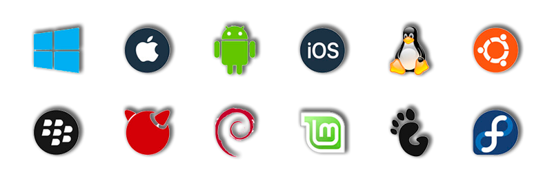{ width="600" }
  <figcaption></figcaption>
</figure>

Un sistema operativo (frecuentemente OS, del inglés _Operating System_) es un programa informático o conjunto de programas que en un sistema informático gestiona los recursos de _hardware_ y da servicios a los programas de aplicación, ejecutándose en modo **privilegiado** respecto de los restantes.

Nótese que es un error común muy extendido denominar al conjunto completo de herramientas sistema operativo, es decir, la inclusión en el mismo término de programas como el explorador de ficheros, el navegador web y todo tipo de herramientas que permiten la interacción con el sistema operativo, también llamado núcleo o kernel.

- Microsoft Windows
- Mac OS X
- GNU/Linux
- Solaris
- FreeBSD
- OpenBSD
- Google Chrome OS
- Debian gnu/Linux
- Ubuntu GNU/Linux

## ⚙️ Firmware

<figure markdown>
  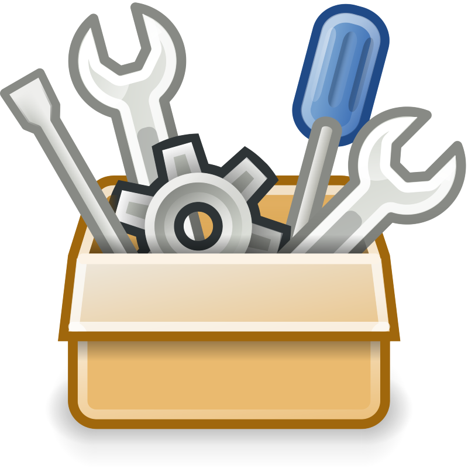{ width="200" }
  <figcaption></figcaption>
</figure>

El firmware es un bloque de instrucciones de máquina para propósitos específicos, grabado en una memoria, normalmente de lectura / escritura (ROM, EEPROM, flash, etc) que establece la lógica de más bajo nivel que controla los circuitos electrónicos de un dispositivo de cualquier tipo.

Está fuertemente integrado con la electrónica del dispositivo siendo el software que tiene directa interacción con el hardware: es el encargado de controlarlo para ejecutar correctamente las instrucciones externas.

En resumen, un firmware **es el software que maneja al hardware**.

El programa **_BIOS_** de una computadora es un firmware cuyo propósito es activar una máquina desde su encendido y preparar el entorno para cargar un sistema operativo en la memoria **RAM**.

## 🛠️ Drivers

<figure markdown>
  { width="200" }
  <figcaption></figcaption>
</figure>

Un driver, llamado normalmente controlador, es un programa informático que permite al sistema operativo interactuar con un periférico, haciendo una abstracción del hardware (estandarizando el uso al sistema operativo) y proporcionando una interfaz -posiblemente estandarizada- para usarlo.

Se puede esquematizar como un manual de instrucciones que le indica cómo debe controlar y comunicarse con un dispositivo en particular.

Por tanto, es una pieza esencial sin la cual no se podría usar el hardware.

!!! INFO "Tipos de Drivers"
    Existen tantos tipos de controladores como tipos de periféricos, y es común encontrar más de un controlador posible para el mismo dispositivo, cada uno ofreciendo un nivel distinto de funcionalidades. Por ejemplo, aparte de los oficiales (normalmente disponibles en la página web del fabricante), se pueden encontrar también los proporcionados por el sistema operativo, o también versiones no oficiales hechas por terceros.

## 🪛 Funcionamiento de un ordenador

<figure markdown>
  { width="400" }
  <figcaption></figcaption>
</figure>

La arquitectura de [von Neumann](https://es.wikipedia.org/wiki/Arquitectura_de_Von_Neumann){target=_blank} es una familia de arquitecturas de computadoras que utilizan el mismo dispositivo de almacenamiento (memoria principal) tanto para las instrucciones como para los datos.

La mayoría de computadoras modernas están basadas en esta arquitectura, aunque pueden incluir otros dispositivos adicionales, (por ejemplo, para gestionar las interrupciones de dispositivos externos como ratón, teclado, etc).

### 💼 Organización

Los computadores con esta arquitectura constan de cinco partes:

- La unidad aritmético-lógica o ALU: es un circuito digital que calcula operaciones aritméticas (como suma, resta, multiplicación, etc.) y operaciones lógicas (si, y, o, no), entre dos números.

- La unidad de control es la circuitería que controla el flujo de datos a través del procesador, y coordina procesador, que a su vez controla el resto del PC.
    - Las salidas de la unidad de control se encargan de controlar la actividad del resto del dispositivo.
    - Las entradas de la unidad de control son las señales enviadas por los dispositivos con el resultado de la actividad que ha sucedido.

- El Registro es una memoria de alta velocidad y poca capacidad, integrada en el microprocesador, que permite guardar transitoriamente y acceder a valores muy usados, generalmente en operaciones matemáticas.

- La memoria principal o RAM se utiliza como memoria de trabajo para el sistema operativo, los programas y la mayoría del software. Es allí donde se cargan todas las instrucciones que ejecutan el procesador y otras unidades de cómputo.

- Los Dispositivos de entrada/salida son los aparatos y/o dispositivos auxiliares e independientes conectados a la unidad central de procesamiento de una computadora, que proporcionan un medio de transporte de los datos entre las distintas partes.

Como se puede observar, la CPU o microprocesador engloba a los registros, ALU y la Unidad de Control.

  [Simulador de un mensaje por pantalla](https://schweigi.github.io/assembler-simulator/){target=_blank}

## 🧫 Jerarquía de la memoria

Se conoce como jerarquía de memoria a la organización piramidal de la memoria en niveles que tienen los computadores. Su objetivo es conseguir el rendimiento de una memoria de gran velocidad al coste de una memoria de baja velocidad, basándose en el principio de cercanía de referencias.

<figure markdown>
  { width="400" }
  <figcaption></figcaption>
</figure>

Los puntos básicos relacionados con la memoria pueden resumirse en:

- Cantidad
- Velocidad
- Coste

La cuestión de la cantidad es simple, cuanto más memoria haya disponible, más podrá utilizarse.

La velocidad óptima para la memoria es la velocidad a la que el procesador puede trabajar, de modo que no haya tiempos de espera entre cálculo y cálculo, utilizados para traer operandos o guardar resultados. En suma, el coste de la memoria no debe ser excesivo, para que sea factible construir un equipo accesible.

Como puede esperarse los tres factores compiten entre sí, por lo que hay que encontrar un equilibrio. Las siguientes afirmaciones son válidas:

- A menor tiempo de acceso mayor coste económico.
- A mayor capacidad de almacenamiento menor coste económico por bit.
- A mayor capacidad de almacenamiento menor velocidad de transferencia.
- Se busca entonces contar con capacidad suficiente de memoria, con una velocidad que sirva para satisfacer la demanda de rendimiento y con un coste que no sea excesivo. Gracias a un principio llamado cercanía de referencias, es factible utilizar una mezcla de los distintos tipos y lograr un rendimiento cercano al de la memoria más rápida.

Los niveles que componen la jerarquía de memoria habitualmente son:

- **Nivel 0**: Registro (hardware)
- **Nivel 1**: Memoria caché
- **Nivel 2**: Memoria principal
- **Nivel 3**: Memorias flash
- **Nivel 4**: Disco duro (con el mecanismo de memoria virtual)
- **Nivel 5**: Cintas magnéticas Consideradas las más lentas, con mayor capacidad.
- **Nivel 6**: Red de computadoras|Redes (Actualmente se considera un nivel más de la jerarquía de memorias)

## 📚 La Memoria Principal

<figure markdown>
  { width="400" }
  <figcaption>Memoria RAM (Random Access Memory)</figcaption>
</figure>

La memoria principal o primaria (Memoria Central) es aquella memoria de un computador donde se almacenan temporalmente, tanto los datos como los programas que la CPU está procesando o va a procesar en un determinado momento.

Por su función, es una amiga inseparable del microprocesador, con el cual se comunica a través de los buses de datos. Por ejemplo, cuando la CPU tiene que ejecutar un programa, primero lo coloca en la memoria y después lo empieza a ejecutar. Lo mismo ocurre cuando necesita procesar una serie de datos; antes de poder procesarlos los tiene que llevar a la memoria principal.

Esta clase de memoria es volátil, es decir que, cuando se corta la energía eléctrica, se borra toda la información que estuviera almacenada en ella.

Por su función, la cantidad de memoria RAM de que disponga una computadora es una factor muy importante; hay programas y juegos que requieren una gran cantidad de memoria para poder usarlos, otros andarán más rápido si el sistema cuenta con más memoria RAM.

El chip o circuito integrado es una pequeña pastilla de material semiconductor (silicio) que contiene múltiples circuitos integrados, tales como transistores, entre otros dispositivos electrónicos, con los que se realizan numerosas funciones en computadoras y dispositivos electrónicos; que permiten, interrumpen o aumentan el paso de la corriente. Estos chips están sobre una tarjeta o placa.

El contenido de las memorias no es otra cosa que dígitos binarios o bits (binary digits), que se corresponden con dos estados lógicos: el 0 (cero) sin carga eléctrica y el 1 (uno) con carga eléctrica. A cada uno de estos estados se le llama bit, que es la unidad mínima de almacenamiento de datos.

El microprocesador direcciona las posiciones de la RAM para poder acceder a los datos almacenados en ellas y para colocar los resultados de las operaciones.

Al "bloque de Memoria Principal", suele llamarse memoria RAM, por ser éste el tipo de chips de memoria que conforman el bloque, pero se le asocian también el chip CMOS, que almacena al programa BIOS del sistema y los dispositivos periféricos de la memoria secundaria (discos y otros periféricos), para conformar el sub-sistema de memoria del computador.

La estructura de la memoria principal ha cambiado en la historia de las computadoras. Desde los años 1980 es prevalentemente una unidad dividida en celdas que se identifican mediante una dirección. Está formada por bloques de circuitos integrados o chips capaces de almacenar, retener o "memorizar" información digital, es decir, valores binarios; a dichos bloques tiene acceso el microprocesador de la computadora.

La Memoria Principal es el núcleo del sub-sistema de memoria de una computadora, y posee una menor capacidad de almacenamiento que la memoria secundaria, pero una velocidad millones de veces superior.

<figure markdown>
  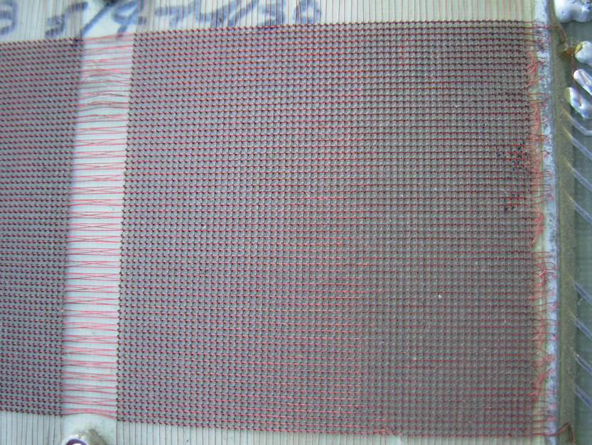{ width="400" }
  <figcaption>Memoria de 1980 donde de unos 4x4 cm ~ 512 bytes.</figcaption>
</figure>

### 📗 Tipos de memoria

En las computadoras son utilizados 2 tipos de memoria:

!!! DANGER "**ROM o memoria de sólo lectura (Read Only Memory)**"
    Viene grabada de fábrica con una serie de programas. El software de la ROM se divide en dos partes:

    - **Rutina de arranque o POST (Power On Self Test, auto diagnóstico de encendido)**
    Realiza el chequeo de los componentes de la computadora; por ejemplo, circuitos controladores de video, de acceso a memoria, el teclado, unidades de disco,etc. Se encarga de determinar cuál es el hardware que está presente y de la puesta a punto de la computadora. Mediante un programa de configuración, el SETUP, lee una memoria llamada CMOS RAM (RAM de Semiconductor de óxido metálico). Ésta puede mantener su contenido durante varios años, aunque la computadora está apagada, con muy poca energía eléctrica suministrada por una batería, guarda la fecha, hora, la memoria disponible, capacidad de disco rígido, si tiene disquetera o no. Se encarga en el siguiente paso de realizar el arranque (booteo): lee un registro de arranque 'BR' (Boot Record) del disco duro o de otra unidad (como CD, USB, etc.), donde hay un programa que carga el sistema operativo a la RAM. A continuación cede el control a dicho sistema operativo y el computador queda listo para trabajar.
    
    - **Rutina BIOS o Sistema Básico de Entrada-Salida (Basic Input-Output System)**
    permanece activa mientras se está usando el computador. Permite la activación de los periféricos de entrada/salida: teclado, monitor, ratón, etc. Se pueden modificar opciones básicas como el horario. Es indiferente al Sistema operativo.

!!! WARNING "RWM o Memoria de lectura-escritura"
    Es la memoria del usuario que contiene de forma temporal el programa, los datos y los resultados que están siendo usados por el usuario del computador. En general es volátil, pierde su contenido cuando se apaga el computador, es decir que mantiene los datos y resultados en tanto el bloque reciba alimentación eléctrica, a excepción de la CMOS RAM. Es común llamar erróneamente a la memoria de lectura escritura (RWM) como memoria (RAM), donde se confunde el tipo de memoria con la forma de acceso a ella. (Ver clasificación de memorias). Tanto la RWM como la ROM son circuitos integrados, llamados comúnmente chips.

## 💱 El Bit y el Byte

**Bit** es el acrónimo _Binary digit_ (dígito binario). Un bit es un dígito del sistema de numeración binario.

Mientras que en el sistema de numeración decimal se usan diez dígitos, en el binario se usan sólo dos dígitos, el 0 y el 1. Un bit o dígito binario puede representar uno de esos dos valores, 0 ó 1.

El bit es la unidad mínima de información empleada en informática, en cualquier dispositivo digital, o en la teoría de la información. Con él, podemos representar dos valores cuales quiera, como verdadero o falso, abierto o cerrado, blanco o negro, norte o sur, masculino o femenino, rojo o azul, etc. Basta con asignar uno de esos valores al estado de "apagado" (0), y el otro al estado de "encendido" (1).

### 👛 Combinaciones de Bits

Con un bit podemos representar solamente dos valores, que suelen representarse como 0, 1. Para representar o codificar más información en un dispositivo digital, necesitamos una mayor cantidad de bits. Si usamos dos bits, tendremos cuatro combinaciones posibles:

<figure markdown>
  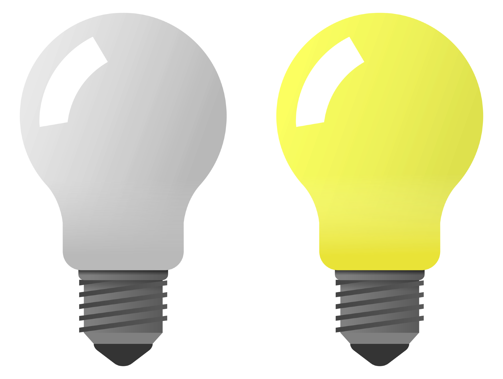{ width="400" }
  <figcaption></figcaption>
</figure>

- 0 0 Los dos están "apagados"
- 0 1 El primero (de izquierda a derecha) está "apagado" y el segundo "encendido"
- 1 0 El primero (de izquierda a derecha) está "encendido" y el segundo "apagado"
- 1 1 Los dos están "encendidos"

Con estas cuatro combinaciones podemos representar hasta cuatro valores diferentes, como por ejemplo, los colores azul, verde, rojo y magenta.

A través de secuencias de bits, se puede codificar cualquier valor discreto como números, palabras, e imágenes. Ocho bits forman un Byte, y se pueden representar hasta 28 = 256 valores diferentes. En general, con un número n de bits pueden representarse hasta 2n valores diferentes.

## 🏛️ Arquitecturas de 32 y 64 bits

Cuando se habla de CPUs o microprocesadores de 32, 64 bits, se refiere al tamaño, en número de bits, que tienen los registros internos del procesador y también a la capacidad de procesamiento de la Unidad aritmético lógica (ALU). Un microprocesador de 32 bits tiene registros de 32 bits y la ALU hace operaciones con los datos en esos registros de 32 bits, mientras que un procesador de 64 bits tiene registros y procesa los datos en grupos de 64 bits.

Los procesadores de 64 bits pueden procesar los datos, dependiendo que su diseño lo permita, de 32 bits y 64 bits. Sin embargo, los registros de un procesador de 32 bits no pueden procesar datos de 64 bits pues no caben en estos registros.

Cuando se habla de procesadores de, digamos 32 bits, nos referimos a su capacidad de procesar datos en hasta 32 bits simultáneamente. La denominación de "microprocesador de 32 bits" no se refiere al tamaño del bus de datos del CPU ni del bus de direcciones, sino a su capacidad de trabajar normalmente con los datos en el número máximo de bits (salvo alguna excepción).

Cuando se habla de procesadores de, digamos 64 bits, nos referimos a su capacidad de procesar datos en hasta 64 bits simultáneamente. La denominación de "microprocesador de 64 bits" no se refiere al tamaño del bus de datos del CPU ni del bus de direcciones, sino a su capacidad de trabajar normalmente con los datos en el número máximo de bits (salvo alguna excepción).

## 👨‍💻 Carga del Sistema Operativo

<figure markdown>
  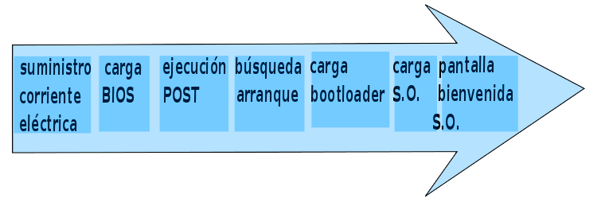{ width="600" }
  <figcaption>Secuencia de carga de un sistema operativo desde que un computador es conectado a la red eléctrica</figcaption>
</figure>

A grandes rasgos, cuando se conecta el suministro de corriente eléctrica el BIOS es cargada en la memoria, luego se ejecuta el POST que verifica el hardware del computador, si no hay errores durante el POST, se encarga de localizar el MBR del disco o una posición determinada de otro dispositivo (disco usb, disco de red, CD,...). Si lo encuentra, carga el bootloader que le pasa el control al sistema operativo oportuno. El sistema operativo es cargado en la memoria y finalmente presenta al usuario una primera pantalla del Sistema Operativo.

<figure markdown>
  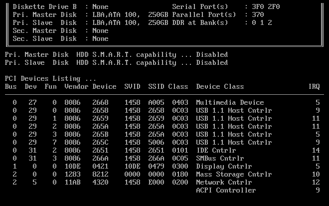{ width="600" }
  <figcaption>Secuancia POST</figcaption>
</figure>

### ⛓️ Ejecución de un programa

Cuando nos _"bajamos"_ o descargamos un programa, es almacenado en una memoria secundaria (disco duro, SD,...) en este medio no es posible su ejecución. Cuando intentamos ejecutar haciendo doble clic en él, el programa es cargado en la memoria principal o RAM. Una vez cargado en la memoria principal, es posible su ejecución por el **Sistema Operativo**.

## 🔧 Montaje y mantenimiento

<figure markdown>
  { width="300" }
  <figcaption></figcaption>
</figure>

Para montar un equipo informático ya sabemos que necesitamos varias cosas para llevar a cabo esta función. Además, como cualquier otro sistema, necesita de un mantenimiento para que todo funcione como el primer día puesto que del uso, los componentes electrónicos pierden sus características.

### 🅱️ Elementos básicos

A continuación vamos a ver una serie de componentes básicos de un ordenador

#### 🔋 Pilas y baterías

<figure markdown>
  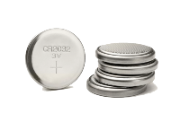{ width="200" }
  <figcaption>Pila de botón</figcaption>
</figure>

Las **pilas** suelen ser una pequeñas baterías redondas y planas que se se adhieren a la placa base con la función de no dejar sin energía a la placa base.

Cuando desenchufamos un ordenador de la toma de corriente, es la pila quién entra en acción para que la configuración de la placa base (la BIOS) junto con la fecha y la hora no se pierdan en el próximo inicio de la máquina.

<figure markdown>
  { width="300" }
  <figcaption>Batería de un portátil</figcaption>
</figure>

Las **baterías** suelen estar presentes en todos los ordenadores portátiles de hoy en día y su función principal es la de proporcionar energía a todo el ordenador para que pueda usarse sin un cable de corriente.

Dichas baterías suelen tener un voltaje y un amperaje determinados así como una determinada duración, dependiendo del rendimiento que le demos a éste.

#### 🔴 Pulsadores

<figure markdown>
  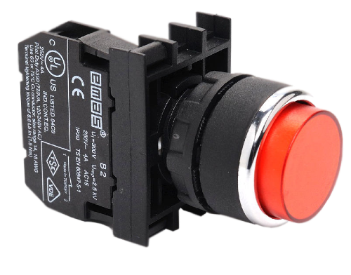{ width="300" }
  <figcaption>Pulsador de encendido</figcaption>
</figure>

Los pulsadores son botones que normalmente al tacto se hunden y envían una señal a la placa base que esté conectada.

Suelen tener 2 estados diferentes:

  - Encendido: Cuando pulsamos
  - Apagado: cuando **NO** tocamos el botón

!!! DANGER "¿dónde encontramos pulsadores?"
    El botón de encendido de un PC, los botones de un ratón, las teclas de un teclado, los botones de un mando para jugar o un mando a distancia son algunos ejemplos

#### 🔰 Interruptores

<figure markdown>
  { width="200" }
  <figcaption></figcaption>
</figure>

Los interruptores (_switch_ en inglés) tienen la función de hacer pasar la energía por un canal (cable) o por otro. Normalmente tienen 2 posiciones pero pueden tener muchas más.

Dicha energía (o señal) puede ser desviada por tantos caminos como posiciones tenga el interruptor.

!!! WARNING "Ejemplo"
    El enchufe de la luz de una casa se consideraría el típico ejemplo de interruptor donde una posición deja pasar la energía para encender la luz y la otra posición envía la energía a la toma de tierra cortando así la luz y apagando la bombilla

## 🖥️ Componentes de un sistema informático

Todo sistema informático está compuesto, como ya hemos visto, por varios dispositivos conectados entre sí mediante cables o soldados directamente en la placa base (_mainboard_).

### 📦 Carcasas

<figure markdown>
  { width="300" }
  <figcaption>Tripas de una carcasa de un PC</figcaption>
</figure>

Son el armazón del equipo que contiene los componentes del computador, normalmente construidos de acero, plástico o aluminio. También podemos encontrarlas de otros materiales como madera o polimetilmetacrilato para cajas de diseño. A menudo de metal electrogalvanizado. Su función es la de proteger los componentes del computador. Es la caja o lugar donde se alojan todos los componentes internos del computador, el tipo de caja a utilizar depende de las características propias de la computadora donde se deben tener en cuenta: el tamaño, tipo de conectores internos, bahías para las unidades reproductoras/grabadoras de CD/DVD y la fuente de alimentación

#### La cubierta

Constituye la parte exterior de la caja y se adhiere al chasis. La mayoría de los computadores utilizan varios tornillos para asegurar la cubierta al chasis, aunque también existen sistemas sin tornillos, que emplean agujeros para sujeción o cierres por deslizamiento. En la actualidad, hay multitud de tipos de cubiertas, con diferentes materiales y colores, que en combinación con el chasis permiten modificar el aspecto del computador a gusto del usuario. Computadores transparentes, con luces de neón, con formas, etc.

#### El panel frontal y cableado LED/SW

El panel frontal cubre la parte delantera de la cubierta y muestra información al usuario acerca del estado del computador mediante luces LED (encendido, uso del disco duro, etc.). Además, contiene los botones o interruptores de encendido y de reinicio (o reset). EI botón de encendido está conectado a la placa base mediante un cable de dos hilos etiquetado como Power SW, que permitirá encender o apagar el computador según la intensidad y duración con la que presionemos el botón.

EI botón de reinicio se suele usar cuando el computador se detiene o bloquea y no responde las órdenes del usuario. Está conectado también a la placa base mediante un cable de dos hilos etiquetado como Reset SW.

Otra de las características de este panel será el número de conectores USB que pueda tener y si dispone de conectores para salida de audio y entrada para micrófono en el frontal del gabinete.

#### Las bahías para unidades

Las bahías para unidades se utilizan para montar unidades de discos flexibles, discos duros, unidades de tarjeta (SD, miniSD, Memory Stick, etc.), CDROM, DVD en el computador. Hay dos tipos: las bahías para unidad internas, que están situadas completamente en el interior de la caja sin salida al exterior y que se emplean para montar unidades como discos duros (que no necesitan un acceso desde fuera del tipo), y las bahías para unidades externas o exteriores, que realmente están situadas dentro del chasis, pero permiten el acceso a ellas desde el exterior. Se utilizan normalmente para las unidades de discos CD-ROM, DVD y similares.

#### Tamaños de Carcasas

El tamaño de las carcasas viene dado por el factor de forma de la placa base. Sin embargo el factor de forma solo especifica el tamaño interno de la caja.

=== "Barebone"
    <figure markdown>
      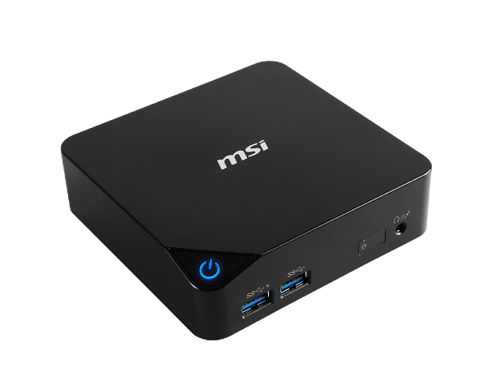{ width="300" }
      <figcaption>Barebone</figcaption>
    </figure>

    Gabinetes de pequeño tamaño cuya función principal es la de ocupar menor espacio y crea un diseño más agradable. Son útiles para personas que quieran dar buena impresión como una persona que tenga un despacho en el que reciba a mucha gente. Los barebone tienen el problema de que la expansión es complicada debido a que admite pocos (o ningún) dispositivos. Otro punto en contra es el calentamiento al ser de tamaño reducido aunque para una persona que no exija mucho trabajo al computador puede estar bien. Este tipo de cajas tienen muchos puertos USB para compensar la falta de dispositivos, como una disquetera (ya obsoleta), para poder conectar dispositivos externos como un disco USB o una memoria.

=== "Minitorre"
    <figure markdown>
      { width="300" }
      <figcaption>Minitorre</figcaption>
    </figure>

    Dispone de una o dos bahías de 5 ¼ y dos o tres bahías de 3 ½. Dependiendo de la placa base se pueden colocar bastantes tarjetas. No suelen tener problema con los USB y se venden bastantes modelos de este tipo de torre ya que es pequeña y a su vez hace las paces con la expansión. Su calentamiento es normal y no tiene el problema de los barebone.

=== "Sobremesa"
    <figure markdown>
      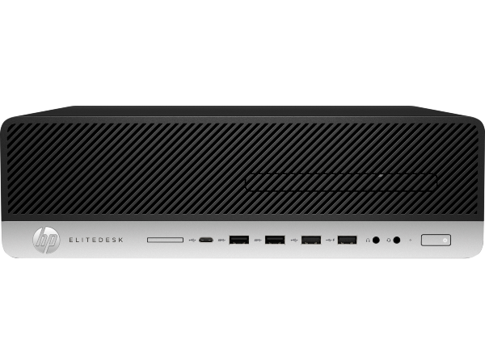{ width="300" }
      <figcaption>Sobremesa</figcaption>
    </figure>

    No se diferencian mucho de las minitorres, a excepción de que en lugar de estar en vertical se colocan en horizontal sobre el escritorio. Antes se usaban mucho, pero ahora están cada vez más en desuso. Se solía colocar sobre ella el monitor.

=== "Semitorre"
    <figure markdown>
      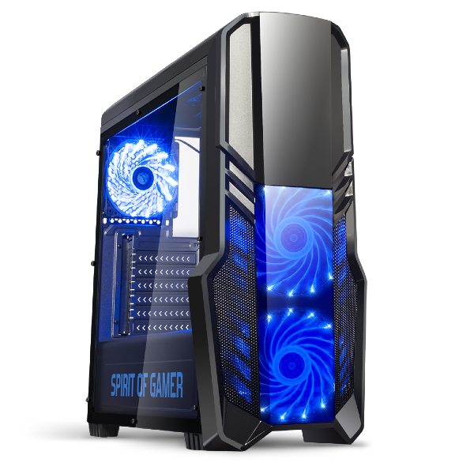{ width="300" }
      <figcaption>Semitorre</figcaption>
    </figure>

    La diferencia de ésta es que aumenta su tamaño para poder colocar más dispositivos. Normalmente son de 4 bahías de 5 ¼ y 4 de 3 ½ y un gran número de huecos para poder colocar tarjetas y demás aunque esto depende siempre de la placa base.

=== "Torre"
    <figure markdown>
      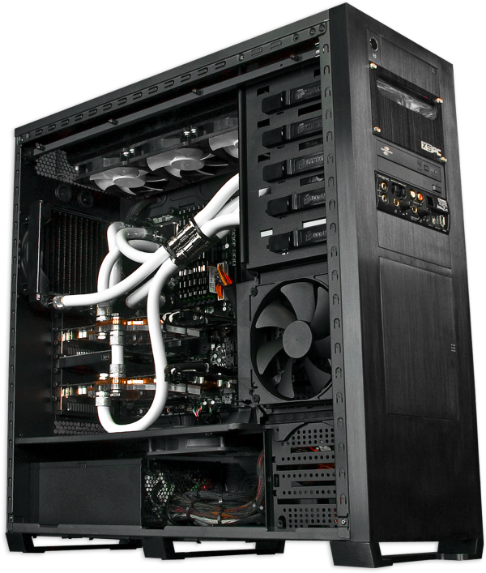{ width="300" }
      <figcaption>Torre</figcaption>
    </figure>

    Es el más grande. Puedes colocar una gran cantidad de dispositivos y es usado cuando se precisa una gran cantidad de dispositivos.

=== "Servidor"
    <figure markdown>
      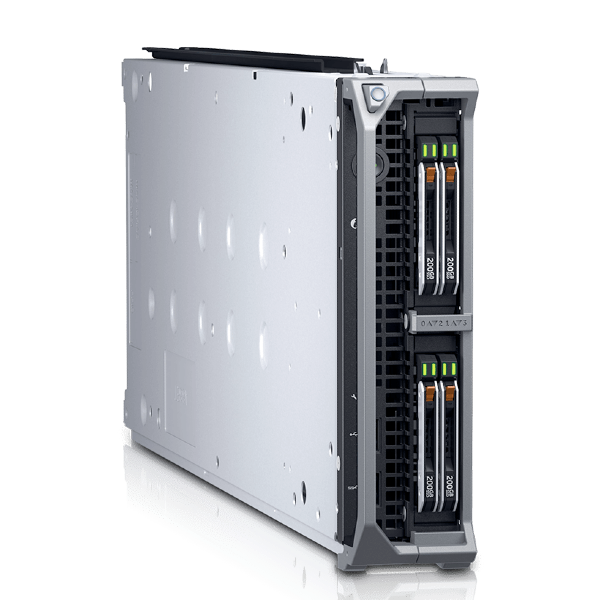{ width="300" }
      <figcaption>Servidor</figcaption>
    </figure>

    Suelen ser gabinetes más anchos que los otros y de una estética inexistente debido a que van destinadas a lugares en los que no hay mucho tránsito de clientes como es un centro de procesamiento de datos. Su diseño está basado en la eficiencia donde los periféricos no son la mayor prioridad sino el rendimiento y la ventilación. Suelen tener más de una fuente de alimentación de extracción en caliente para que siga funcionando el servidor en el caso de que se estropee una de las dos y normalmente están conectados a un SAI que protege a los equipos de los picos de tensión y consigue que en caso de caída de la red eléctrica el servidor siga funcionando por un tiempo limitado.

=== "Rack"
    <figure markdown>
      { width="300" }
      <figcaption>Rack</figcaption>
    </figure>

    Son otro tipo de servidores. Normalmente están dedicados y tienen una potencia superior que cualquier otro computador. Los servidores rack se atornillan a un mueble que tiene una medida especial: la "U". Una "U" es el ancho de una ranura del mueble. Este tipo de servidores suele colocarse en salas climatizadas debido a la temperatura que alcanza.

### ✨ Fuente de alimentación

<figure markdown>
  { width="600" }
  <figcaption>Fuente de alimentación de un PC</figcaption>
</figure>

La fuente de alimentación (_Power Supply Unit_) tiene la función de transformar la energía de [corriente alterna](https://es.wikipedia.org/wiki/Corriente_alterna){target="_blank"} (CA) a [corriente contínua](https://es.wikipedia.org/wiki/Corriente_continua){target="_blank"} (CC) para alimentar los circuitos electrónicos y los dispositivos conectados a dichos circuitos; en nuestro caso, a la placa base.

Por un lado, tenemos un cable que viene del enchufe de nuestra casa y se conecta a la **fuente de alimentación** que transforma la energía y la dispersa a través de numerosos cables de distintos colores y clavijas a todos los aparatos de la placa base.

<figure markdown>
  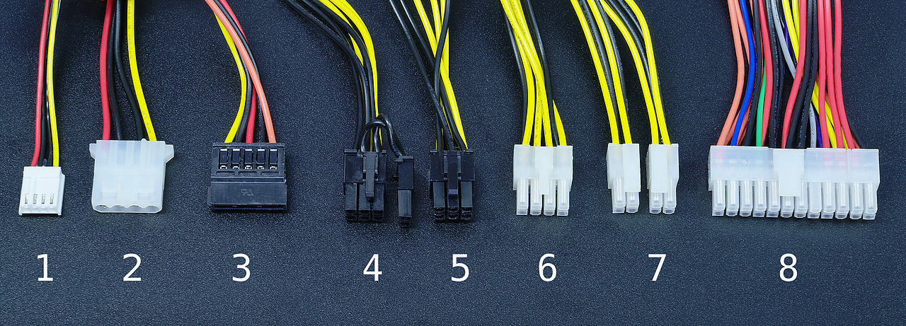{ width="600" }
  <figcaption>Conectores Fuente de Alimentación</figcaption>
</figure>

!!! INFO "Dato importante"
    Como norma general, las fuentes de alimentación vienen con un ventilador, instalado en la parte donde conectamos el cable de electricidad, que hace la función de enfriar la propia fuente para que no se sobrecaliente

Existen varios tipos de fuentes de alimentación, cada uno con sus características distintas en cuestión de conexiones, voltaje, ventilación, tamaño y demás. En función de lo que nuestro equipo necesite, elegiremos un tipo de fuente de alimentación u otra.

### 🌌 Placa Base

<figure markdown>
  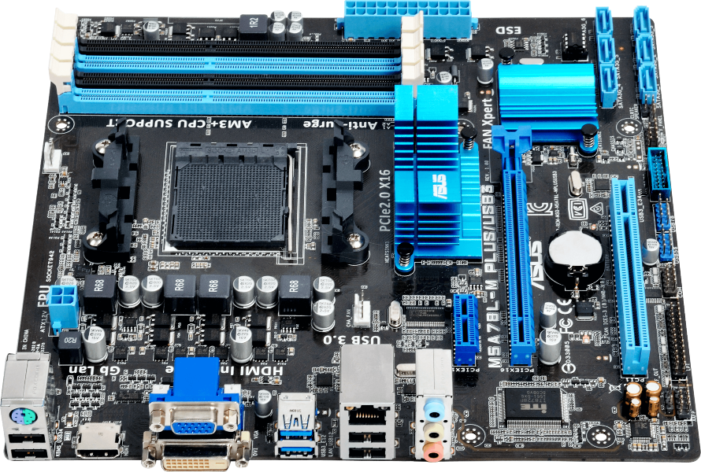{ width="200" }
</figure>

La placa base, también conocida como placa madre o tarjeta madre (del inglés motherboard o mainboard) es una tarjeta de circuito impreso a la que se conectan los componentes que constituyen la computadora.

Es una parte fundamental a la hora de armar un PC de escritorio o servidor. Tiene instalados una serie de circuitos integrados, entre los que se encuentra el chipset, que sirve como centro de conexión entre el microprocesador, la RAM, las ranuras de expansión y otros dispositivos.

!!! WARNING
    La elección de la placa base (tipo, tamaño) marcará el resultado del computador pues por una parte puede aumentar o disminuir el coste del producto y también puede tener más prestaciones o simplemente no tenerlas.
    
    Por ejemplo, si elegimos una placa base barata (generalmente de pequeño tamaño), tendrá muy pocos conectores y puede resultar inapropiada al intentar ampliar con tarjetas de expansión; sin embargo, si elegimos una placa base grande (generalmente cara), tendrá muchas prestaciones que a lo peor no usamos en toda su vida útil y además, nos ocupará más espacio.

Va instalada dentro de una caja o gabinete que por lo general está hecha de chapa y tiene un panel para conectar dispositivos externos y muchos conectores internos y zócalos para instalar componentes dentro de la caja.

La placa base, además, incluye un firmware llamado BIOS, que le permite realizar las funcionalidades básicas, como pruebas de los dispositivos, vídeo y manejo del teclado, reconocimiento de dispositivos y carga del sistema operativo.

=== "ATX"
    <figure markdown>
      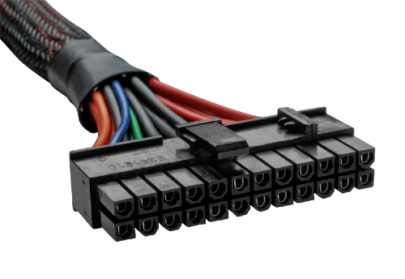{ width="200" }
    </figure>

    Uno o varios conectores de alimentación ATX: por estos conectores, una alimentación eléctrica proporciona a la placa base los diferentes voltajes e intensidades necesarios para su funcionamiento.

=== "Zócalo CPU"
    <figure markdown>
      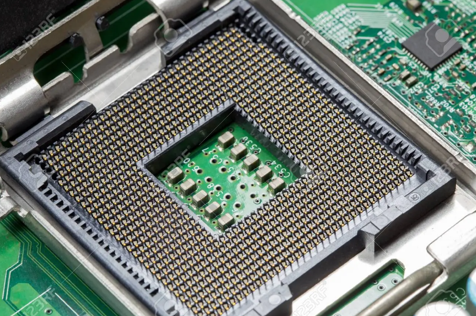{ width="200" }
    </figure>

    El zócalo de CPU es un receptáculo que recibe el microprocesador y lo conecta con el resto de componentes a través de la placa base.

=== "RAM"
    <figure markdown>
      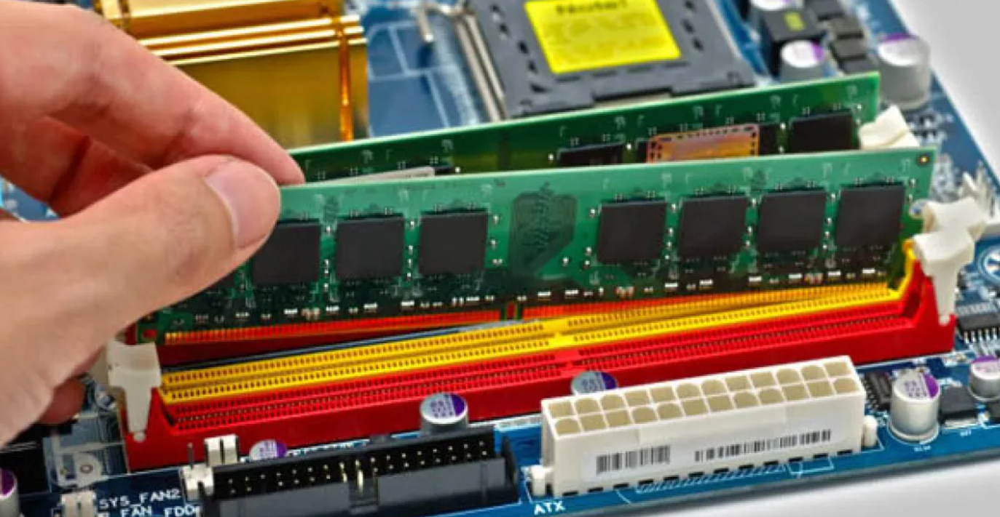{ width="200" }
    </figure>
    Las ranuras de memoria RAM, en número de 2 a 6 en las placas base comunes

=== "Chipset"
    <figure markdown>
      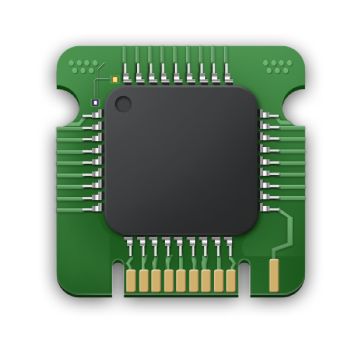{ width="200" }
    </figure>
    Una serie de circuitos electrónicos, que gestionan las transferencias de datos entre los diferentes componentes de la computadora (procesador, memoria, tarjeta gráfica, unidad de almacenamiento secundario, etc.)

=== "Reloj"
    <figure markdown>
      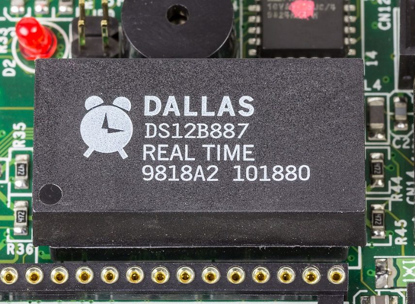{ width="200" }
    </figure>
    Regula la velocidad de ejecución de las instrucciones del microprocesador y de los periféricos internos.

=== "CMOS"
    <figure markdown>
      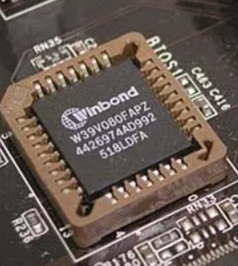{ width="200" }
    </figure>
    Una pequeña memoria que preserva cierta información importante (como la configuración del equipo, fecha y hora), mientras el equipo no está alimentado por electricidad.

=== "Pila"
    <figure markdown>
      { width="200" }
    </figure>
    Proporciona la electricidad necesaria para operar el circuito constantemente y que éste último no se apague perdiendo la serie de configuraciones guardadas.

=== "BIOS"
    <figure markdown>
      { width="200" }
    </figure>
    Un programa registrado en una memoria no volátil, se emplean memorias flash.

    !!! DANGER "CUIDADO"
        No confundir con la configuración de la BIOS que SI QUE ÉS VOLÁTIL

=== "BUS"
    Conecta el microprocesador al chipset

    - El BUS de memoria: Conecta el _chipset_ a la memoria temporal
    - El BUS de expansión: (también llamado bus I/O) une el microprocesador a los conectores entrada/salida y a las ranuras de expansión.

=== "I/O Entrada Salida"
    <figure markdown>
      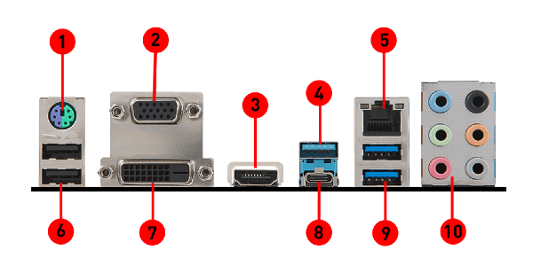{ width="200" }
    </figure>
    Diferenciamos diferentes puertos en una placa base:

    - Los puertos PS2 para conectar el teclado o el ratón, estas interfaces tienden a desaparecer a favor del USB
    - Los puerto serie, por ejemplo para conectar dispositivos antiguos.
    - Los puerto paralelo, por ejemplo para la conexión de antiguas impresoras.
    - Los puertos USB, por ejemplo para conectar periféricos recientes.
    - Los conectores RJ45, para conectarse a una red informática.
    - Los conectores VGA, DVI, HDMI para la conexión del monitor de la computadora.
    - Los conectores PATA o SATA, para conectar dispositivos de almacenamiento, tales como unidad de disco duro|discos duros, unidades de estado sólido y Unidad de disco óptico.
    - Los conectores de audio, para conectar dispositivos de audio, tales como altavoces o micrófonos.

=== "Ranuras de expansión"
    <figure markdown>
      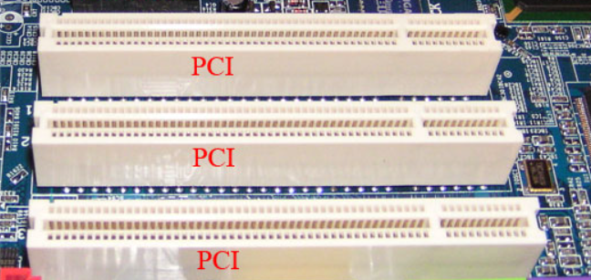{ width="200" }
    </figure>
    Se trata de receptáculos que pueden acoger tarjetas de expansión

## 🧰 EJERCICIOS

1. ❎ Averigua el coste de una licencia del sistema operativo Windows y de alguna distribución Linux como Ubuntu, Suse Linux o Fedora.

2. ❎ ¿Cómo puedo conectar el PC a la televisión, cables requeridos y procedimiento de conexión?. En el caso de que existan varias formas de conectar PC y televisión, ¿cuál es la que me dará mejor calidad de imagen?

3. ❎ Explica qué ventajas y desventajas que tienen los sistemas operativos basados en Linux frente a los sistemas operativos Microsoft.

4. ❎ En los teléfonos móviles más modernos (smartphones) tienen algún tipo de firmware o sistema operativo. Enumera al menos cuatro Sistemas Operativos.

5. ❎ ¿Para qué sirve un SAI (UPS en inglés)?, Encuentra dos SAI’s de uso doméstico y sus precios, añade algunas fotos de varios modelos con sus precios y características.

6. ❎ Averigua el tipo de memoria RAM (SDRAM, SRAM, DDRAM, DDR...) tiene tu equipo (casa o clase) y las características tiene dicha memoria.

7. ❎ Averigua qué tipo de BIOS utiliza tu computador (AMI, AWARD…). Busca en Internet alguna manera de hacerlo y escribe en el documento que vayas a enviar la información que te da el programa.

8. ❎ ¿Para qué sirve la pila de la BIOS?, ¿Qué sucede cuando ésta deja de funcionar?, ¿en los nuevos computadores ocurre lo mismo cuando deja de funcionar?.

9. ❎ Existen muchos tipos de licencias de software . ¿Qué es una EULA?. Enumera los derechos y deberes de los tipos de licencias: GPL, Freeware, Shareware, privativa.

10. ❎ Hay otro tipo de placas base de uso empresarial que funcionan con dos o más procesadores en una misma placa base son del tipo asimétrico. Localiza una de ellas y enumera las características, precio, ventajas y desventajas y una foto o diagrama.

11. ❎ Explica qué es el POST y para qué sirve. ¿Qué significan dichas siglas y cuando se ejecuta?, ¿solo lo realizan los computadores?.

12. ❎ Identifica los distintos conectores que se muestran en la fotografía de **La fuente de alimentación** y ponlos en un documentos enumerados del 1 al 8 tal y como salen en la foto. Busca información en Internet para realizar el ejercicio.