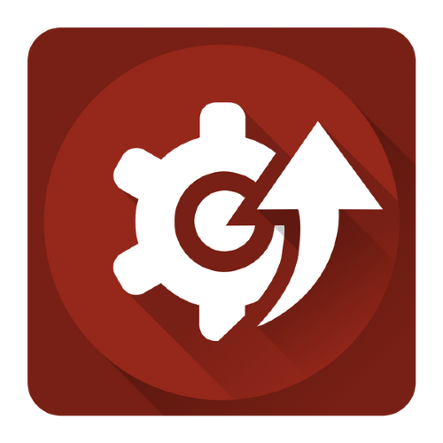

---
hide:
  - footer
---

# Montaje y mantenimiento de sistemas informáticos

El objetivo de este tema es servir de introducción al resto de contenidos de este wikilibro. Además se describen los componentes electrónicos y funcionales del ordenador que sirven de base para el resto de unidades y no se tratan en ellas. Después de leer el tema se deberían conocer y entender los siguientes puntos y diferecias entre:

- software y hardware.
- firmware y driver de cada dispositivo.
- jerarquías de la memoria y sus funciones.
- tipos de arquitecturas.

## Vocabulario

??? INFO "Boot"
    La secuencia de arranque, (boot o booting en inglés) es el proceso que inicia el sistema operativo cuando el usuario enciende una computadora. Se encarga de la inicialización del sistema y de los dispositivos.

??? INFO "DMA"
    El acceso directo a memoria (DMA, del inglés direct memory access) permite a cierto tipo de componentes de una computadora acceder a la memoria del sistema para leer o escribir independientemente de la unidad central de procesamiento (CPU) principal.

??? INFO "IRQ"
    Interrupción (también conocida como interrupción de hardware o petición de interrupción) es una señal recibida por el procesador de un computador, indicando que debe "interrumpir" el curso de ejecución actual y pasar a ejecutar código específico para tratar esta situación.

??? INFO "Plug-and-play o PnP"
    _**"enchufar y usar"**_ es la tecnología que permite a un dispositivo informático ser conectado a una computadora sin tener que configurar mediante jumpers. El sistema operativo con el que funciona el computador debe tener soporte para dicho dispositivo. Plug-and-play no significa que no sea necesario instalar drivers de dispositivos adicionales para el correcto funcionamiento del dispositivo. Esto es, Plug and Play NO es sinónimo de "no necesita drivers". Durante el inicio, las tarjetas de la familia PCI y USB interactúan y negocian los recursos solicitados con el sistema. Esto permite asignación de IRQs.

??? INFO "Núcleo o kernel"
    Es un software que constituye la parte más importante del sistema operativo. Es el principal responsable de facilitar a los distintos programas acceso seguro al hardware de la computadora o en forma básica, es el encargado de gestionar recursos, a través de servicios de llamada al sistema.

??? INFO "Tasa de transferencia (_Bit rate_)"
    Tasa de Transferencia o tasa de bits (en inglés bit rate) define el número de bits que se transmiten por unidad de tiempo a través de un sistema de transmisión digital o entre dos dispositivos digitales. Así pues, es la velocidad de transferencia de datos.

??? INFO "Semiconductor"
    Es un elemento que se comporta como un conductor o como aislante eléctrico dependiendo de diversos factores, como por ejemplo el campo eléctrico o magnético, la presión, la radiación que le incide, o la temperatura del ambiente en el que se encuentre.

??? INFO "Volátil"
    Es una propiedad de inconsistencia que tienen algunos dispositivos a perder la información almacenada en ellos cuando se deja de suministrar energía eléctrica. Se aplica a la memoria RAM.

## Sistema informático

<figure markdown>
  { width="400" }
  <figcaption></figcaption>
</figure>

Un sistema informático, como todo sistema, es el conjunto de partes interrelacionadas, hardware, software y de recurso humano que permite almacenar y procesar información.

El **hardware** incluye computadoras o cualquier tipo de dispositivo electrónico, que consisten en procesadores, memoria, sistemas de almacenamiento externo, etc (son tangibles, se pueden tocar).

El **software** incluye al sistema operativo, firmware y aplicaciones, siendo especialmente importante los sistemas de gestión de bases de datos (son intangibles, no se pueden tocar).

Por último el **soporte** humano incluye al personal técnico que crean y mantienen el sistema (analistas, programadores, operarios, etc.) y a los usuarios que lo utilizan.

## Programa

Un programa informático es un conjunto de instrucciones que una vez ejecutadas realizarán una o varias tareas en una computadora. Sin programas, estas máquinas no pueden funcionar.

Al conjunto general de programas, se le denomina _software_, que más genéricamente se refiere al equipamiento lógico o soporte lógico de una computadora digital.

## Sistema Operativo

<figure markdown>
  { width="600" }
  <figcaption></figcaption>
</figure>

Un sistema operativo (frecuentemente OS, del inglés _Operating System_) es un programa informático o conjunto de programas que en un sistema informático gestiona los recursos de _hardware_ y da servicios a los programas de aplicación, ejecutándose en modo **privilegiado** respecto de los restantes.

Nótese que es un error común muy extendido denominar al conjunto completo de herramientas sistema operativo, es decir, la inclusión en el mismo término de programas como el explorador de ficheros, el navegador web y todo tipo de herramientas que permiten la interacción con el sistema operativo, también llamado núcleo o kernel.

- Microsoft Windows
- Mac OS X
- GNU/Linux
- Solaris
- FreeBSD
- OpenBSD
- Google Chrome OS
- Debian gnu/Linux
- Ubuntu GNU/Linux

## Firmware

<figure markdown>
  { width="200" }
  <figcaption></figcaption>
</figure>

El firmware es un bloque de instrucciones de máquina para propósitos específicos, grabado en una memoria, normalmente de lectura / escritura (ROM, EEPROM, flash, etc) que establece la lógica de más bajo nivel que controla los circuitos electrónicos de un dispositivo de cualquier tipo.

Está fuertemente integrado con la electrónica del dispositivo siendo el software que tiene directa interacción con el hardware: es el encargado de controlarlo para ejecutar correctamente las instrucciones externas.

En resumen, un firmware **es el software que maneja al hardware**.

El programa **_BIOS_** de una computadora es un firmware cuyo propósito es activar una máquina desde su encendido y preparar el entorno para cargar un sistema operativo en la memoria **RAM**.

## Drivers

<figure markdown>
  { width="200" }
  <figcaption></figcaption>
</figure>

Un driver, llamado normalmente controlador, es un programa informático que permite al sistema operativo interactuar con un periférico, haciendo una abstracción del hardware (estandarizando el uso al sistema operativo) y proporcionando una interfaz -posiblemente estandarizada- para usarlo.

Se puede esquematizar como un manual de instrucciones que le indica cómo debe controlar y comunicarse con un dispositivo en particular.

Por tanto, es una pieza esencial sin la cual no se podría usar el hardware.

!!! INFO "Tipos de Drivers"
    Existen tantos tipos de controladores como tipos de periféricos, y es común encontrar más de un controlador posible para el mismo dispositivo, cada uno ofreciendo un nivel distinto de funcionalidades. Por ejemplo, aparte de los oficiales (normalmente disponibles en la página web del fabricante), se pueden encontrar también los proporcionados por el sistema operativo, o también versiones no oficiales hechas por terceros.

## Funcionamiento de un ordenador

<figure markdown>
  { width="400" }
  <figcaption></figcaption>
</figure>

La arquitectura de [von Neumann](https://es.wikipedia.org/wiki/Arquitectura_de_Von_Neumann){target=_blank} es una familia de arquitecturas de computadoras que utilizan el mismo dispositivo de almacenamiento (memoria principal) tanto para las instrucciones como para los datos.

La mayoría de computadoras modernas están basadas en esta arquitectura, aunque pueden incluir otros dispositivos adicionales, (por ejemplo, para gestionar las interrupciones de dispositivos externos como ratón, teclado, etc).

### Organización

Los computadores con esta arquitectura constan de cinco partes:

- La unidad aritmético-lógica o ALU: es un circuito digital que calcula operaciones aritméticas (como suma, resta, multiplicación, etc.) y operaciones lógicas (si, y, o, no), entre dos números.

- La unidad de control es la circuitería que controla el flujo de datos a través del procesador, y coordina procesador, que a su vez controla el resto del PC.
    - Las salidas de la unidad de control se encargan de controlar la actividad del resto del dispositivo.
    - Las entradas de la unidad de control son las señales enviadas por los dispositivos con el resultado de la actividad que ha sucedido.

- El Registro es una memoria de alta velocidad y poca capacidad, integrada en el microprocesador, que permite guardar transitoriamente y acceder a valores muy usados, generalmente en operaciones matemáticas.

- La memoria principal o RAM se utiliza como memoria de trabajo para el sistema operativo, los programas y la mayoría del software. Es allí donde se cargan todas las instrucciones que ejecutan el procesador y otras unidades de cómputo.

- Los Dispositivos de entrada/salida son los aparatos y/o dispositivos auxiliares e independientes conectados a la unidad central de procesamiento de una computadora, que proporcionan un medio de transporte de los datos entre las distintas partes.

Como se puede observar, la CPU o microprocesador engloba a los registros, ALU y la Unidad de Control.

[Simulador de un mensaje por pantalla](https://schweigi.github.io/assembler-simulator/){target=_blank}