---
hide:
  - footer
---

# Ensamblaje de componentes, seguridad y documentación técnica

En este tema vamos a aprender cómo montar y desmontar ordenadores, así como a intentar reparar los fallos de hardware que puedan ir surgiendo en los experimentos.

También veremos una de las partes más importantes a la hora de manipular ordenadores, la seguridad.

Cuando termines el tema, seremos capaces de reconocer cualquier componente de un PC y tendremos la habilidad de sustituir cualquier aparato electrónico dentro de un ordenador o periférico.

Por último, seremos capaces de encontrar la documentación de cada uno de los dispositivos para poder seguir las instrucciones del fabricante.

## 📒 Vocabulario

??? INFO "Control PWM"
    es un control de velocidad del ventilador por medio de impulsos. Es utilizado para controlar la velocidad del ventilador del procesador evitando un mayor desgaste de los rodamientos y un mayor ruido

??? INFO "Fanbus"
    es un concentrador o hub (en inglés) en el que se pueden conectar varios ventiladores. Se utiliza cuando en la placa base tiene un menor número de conexiones que las necesitadas

??? INFO "Heat-pipe"
    es un sistema de refrigeración aplicada en casi todos los disipadores de alto rendimiento. Se basa en un tubo de cobre hueco por el que circula un líquido que se evapora en las zonas más calientes (absorbiendo el calor) y licuándose en las zonas más frías (expulsando el calor)

??? INFO "Poka-yoke (sistema a prueba de tontos)"
    es una técnica de calidad que se aplica con el fin de evitar errores en la operación de un sistema. Se utiliza en casi todos los conectores de la placa base para evitar conexionado erróneo. Se empezó a utilizar en Toyota (1960)

??? INFO "Slot"
    es un conector o puerto de expansión de la placa base. Permite conectar en él tarjetas de expansión

??? INFO "Socket o zócalo"
    es un pequeño pedestal donde se inserta el procesador en la placa base. Para evitar confusiones, solo se puede conectar al procesador con una posición

??? INFO "Termoconductor"
    es un material, generalmente metálico, que permite el traspaso de calor por él

## 📃 Documentación técnica
<figure markdown>
  { width="400" }
  <figcaption></figcaption>
</figure>

Todos los aparatos o componentes electrónicos de un ordenador disponen de un manual de usuario o documentación técnica.

En dicha documentación se especifican las características técnicas del aparato y cómo debe usarse para garantizar una correcta funcionalidad del dispositivo.

Antiguamente podíamos encotrar libretos impresos con las instrucciones o manual de usuario dentro de las cajas de los propios componentes. Cuando ibas a una tienda a comprar una tarjeta gráfica nueva, ésta venía dentro de una caja de cartón, con un disquet o CD-ROM que contenía tanto los drivers para varios sistemas operativos así como el manual de usuario y software para poder leer la documentación que solía venir en formato PDF o **RTF** (texto enriquecido)

<figure markdown>
  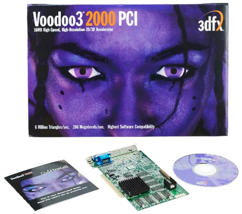{ width="300" }
  <figcaption>Tarjeta gráfica Voodoo 3 ~ 16MB</figcaption>
</figure>

### 🔎 Buscando documentación técnica
<figure markdown>
  { width="300" }
  <figcaption></figcaption>
</figure>

Gracias a Internet podemos buscar y encontrar un sinfín de documentación técnica en varios idiomas.

Si que es verdad que abundan los manuales y guías de usuario en inglés pero la mayoría de documentos vienen con esquemas o dibujos muy claros sin necesidad de saber el idioma en concreto.

La documentación de los aparatos electrónicos o componentes de un ordenador es muy útil a la hora de montarlos ya que nos brinda información acerca de las características, cómo debemos montarlo, si es compatible con otros dispositivos etc.

!!! INFO "Dónde encontrar"
    Lo más sencillo es ir directamente a la página del fabricante del dispositivo y buscar allí la documentación que queramos dentro de la sección **soporte** (o ***support*** en inglés)  
    Ⓜ️ [Página oficial de MSI](https://es.msi.com/){target="_blank"} 
    📄 [Documentación de Placas Base](https://www.pdf-manuals.com/175-motherboards){target="_blank"} 
    ⌨️ [Manuals LIB](https://www.manualslib.com/){target="_blank"}

Puede ocurrir que existan varios modelos de un mismo aparato y a simple vista no se diferencia fácilmente. Por tanto, es muy probable que nos descarguemos el manual que no toca.

Para ello, es conveniente seguir estos pasos antes de ponerse a buscar documentación en Internet:

        - Conocer la marca del dispositivo
        - Saber el modelo
        - Encontrar el número de serie (Serial Number o S/N)

Toda esta información podemos verla en la caja del producto o, si no disponemos de ella en el mismo dispositivos, a veces, hay pegatinas o etiquetas adheridas con la información que buscamos.

En las placas base por ejemplo, podemos encontrar esta informacion serigrafiada en la propia placa.

<figure markdown>
  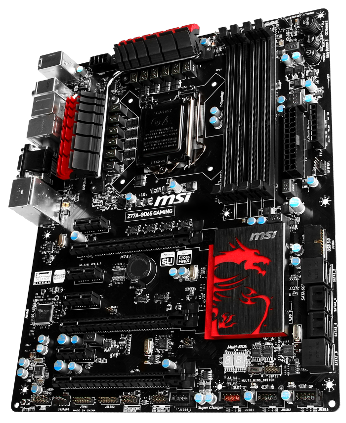{ width="300" }
  <figcaption>Marca: MSI ~ Modelo: Z77A-GD65 GAMING</figcaption>
</figure>

### 🤯 Entendiendo documentación técnica
<figure markdown>
  { width="300" }
  <figcaption></figcaption>
</figure>

Todos los manuales tienen un índice de contenidos donde podremos buscar más cómodamente la información que estamos buscando.

No obstante, primero debemos encontrar el idioma preferido.

Una vez encontrado el idioma, buscaremos el índice y nos iremos a la página que marca para leer la información que estamos buscando.

Si la documentación tiene un esquema o dibujo de los componentes del dispositivo nos ayudará mucho a la hora de entender cómo funciona.

➡️ Hagamos un ejemplo práctico [este manual de usuario de MSI](media/manual-placa-base.zip) ⬅️

## 🤹 Manipulando equipos
<figure markdown>
  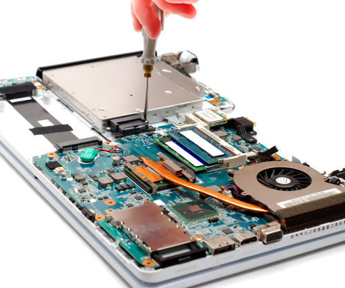{ width="300" }
  <figcaption></figcaption>
</figure>

Cuando nos ponemos manos a la obra debemos tener en cuenta ciertos aspectos antes de ponernos a manipular equipos informáticos.

Los dispositivos electrónicos son muy vulnerables a la temperatura, líquidos, humedad, presión que ejercemos sobre ellos, subidas y bajadas de tensión electríca y electricidad estática.

Por lo tanto, debemos tener cuidado si queremos que todo salga bien. Por ello, vamos a tener en cuenta una serie de pasos a la hora de abrir o manipular un dispositivo electrónico.

### 🌳 Entorno o espacio de trabajo
<figure markdown>
  { width="300" }
  <figcaption></figcaption>
</figure>

Posiblemente sea uno de los pasos más importantes a la hora de trabajar con equipos electrónicos pero también, el más olvidado.

El entorno (espacio que nos rodea) debe estar preparado para la función que vayamos a desempeñar. Debemos preparar el espacio para manipular, con seguridad, lo que queremos montar o desmontar.

!!! DANGER "Pasos para conseguir un buen entorno"
    1. Medir el dispositivo (o el conjunto de dispositivos) a tratar
    2. Conseguir un área o espacio del doble de tamaño del dispositivo que hemos medido
    3. Despeja la zona o espacio de trabajo
    4. Intentar tener acceso desde los 4 lados ⬅️⬆️➡️⬇️ para no tener que mover la pieza
    5. Tener una segunda zona de trabajo más pequeña en caso de que haya que limpiar algún dispositivo o poner otras piezas
    6. Preparar las herramientas necesarias y el equipo de protección
    7. Tener a mano el manual de usuario de la pieza o piezas en cuestión
    8. Hacer fotos del dispositivo o dispositivos para comprobar el antes y el después
    9. Disponer de un objeto para meter piezas pequeñas (si hay tornillos u otras piezas pequeñas que vayamos a desmontar)
    10. Hacer un esquema (puede ser mental) con los pasos que vamos a realizar

### 🛠️ Herramientas necesarias
<figure markdown>
  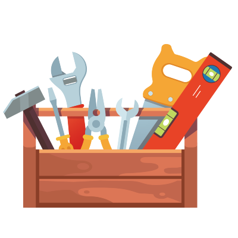{ width="300" }
  <figcaption></figcaption>
</figure>

Cuando ya tenemos el espacio de trabajo preparado y sabemos lo que vamos a hacer, es hora de ponerse a trabajar.

Antes de lanzarse a montar o desmontar todo debemos cerciorarnos de que, tenemos a nuestra disposición, todas las herramientas necesarias para hacer la tarea que vamos a realizar.

Para ello habrá que echar un vistazo a la documentación para ver si viene recogido el listado de herramientas que necesitamos y si no, ver el dispositivo y reunir las herramientas que tenemos que usar para montar o desmontar todo.

#### 🪛 Destornilladores

Un destornillador es una herramienta que se utiliza para apretar y aflojar tornillos y otros elementos de máquinas que requieren poca fuerza de apriete y que generalmente son de diámetro pequeño.

<figure markdown>
  
  <figcaption>Plano ~ Estrella ~ Philips</figcaption>
</figure>

**Plano:** muy común pero poco usado en el montaje de equipos informáticos.

**Estrella:** se utiliza en el montaje de equipos informáticos, generalmente en la unión de piezas plásticas.

**Philips:** muy utilizado, es el más común, en el montaje de equipos informáticos, generalmente en la unión de piezas. Se suele confundir con el tipo estrella y se descabotan los tornillos.

#### 🧪 Pasta Térmica

<figure markdown>
  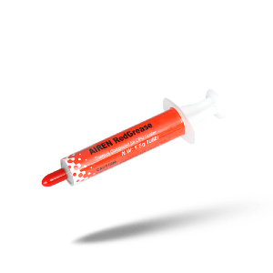{ width="200" }
  <figcaption></figcaption>
</figure>

La pasta térmica, también llamada silicona térmica, masilla térmica o grasa térmica (o también "pasta, silicona, masilla o grasa para semiconductores"), es una sustancia que incrementa la conducción de calor entre las superficies de dos o más objetos que pueden ser irregulares y no hacen contacto directo. En informática es frecuentemente usada la pasta térmica para ayudar a la disipación del calor de componentes mediante un disipador.

La propiedad más importante de la pasta térmica es su conductividad térmica, que se mide en vatios por metro-kelvin (W/(m·K)) ó en vatios por metro Celsius (W/(m·C)). Estas dos medidas son equivalentes (W/(m·K))=(W/(m·C)).

Existen tres tipos de pasta térmica:

**silicona con silicio:** de color blanco generalmente. 
**silicona con plata:** de color plateado generalmente. 
**silicona con cerámica:** de color blanco generalmente.

La silicona es un aislante de calor (no es un conductor de calor) y la plata es uno de los mejores conductores de calor. En principio, podría decirse que la pasta con alto contenido de plata y bajo contenido de silicona sería la mejor pasta pero no es cierto. No es cierto porque se necesita cierta viscosidad para que la pasta llegue a los pequeñísimos rincones y pueda recoger el calor. La solución como siempre es la ficha técnica del producto en la que nos indica la conductividad térmica. Por ejemplo podemos encontrar pasta térmica 11,2 W/mC de Prolimatech, 8,3 W/mK de Antec.

#### 🦞 Pinzas

<figure markdown>
  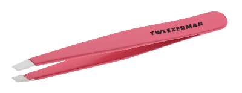{ width="300" }
  <figcaption></figcaption>
</figure>

Una pinza o pinzas es una máquina-herramienta simple cuyos extremos se aproximan para sujetar algo. Funciona con el mecanismo de palancas simples, que pueden ser accionadas manualmente o con mecanismos hidráulicos, neumáticos o eléctricos. Existen pinzas para diferentes usos: corte, sujeción, prensa o de presión.

#### 🎗️ Bridas
<figure markdown>
  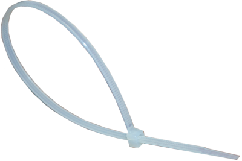{ width="300" }
  <figcaption></figcaption>
</figure>

Una brida es un elemento de sujeción generalmente empleado para unir cables, favoreciendo la ventilación de los componentes internos y evitando posibles vibraciones y ruidos entre los cables, la caja o dispositivos con movimiento (ventiladores, discos duros, etc).

#### 📢 Aspiradora de mano regulable
<figure markdown>
  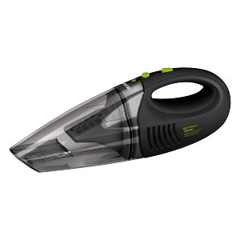{ width="300" }
  <figcaption></figcaption>
</figure>

Una aspiradora es un dispositivo que utiliza una bomba de aire para aspirar el polvo y otras partículas pequeñas de suciedad. Debe ser regulable porque hay aspiradoras que pueden dañar los componentes por su capacidad de succión.

#### 🧴 Bote de aire comprimido seco
<figure markdown>
  { width="150" }
  <figcaption></figcaption>
</figure>

Un bote de aire comprimido seco es un spray de aire que no contiene humedad, al pulverizarlo sobre un componente hardware, lo limpia de polvo. Debido al frío que produce su pulverizado, puede helar la humedad del ambiente produciendo un poco de escarcha en el componente, la cual a los pocos segundos se evapora.

!!! WARNING "Es más eficiente que el soplado pues evita que"
    vaya salivación a los componentes, evitando el posterior cortocircuito.
    vaya el polvo del computador a la cara de quien lo expele.

#### 🌩️ Pulsera y Mantel antiestático

<figure markdown>
  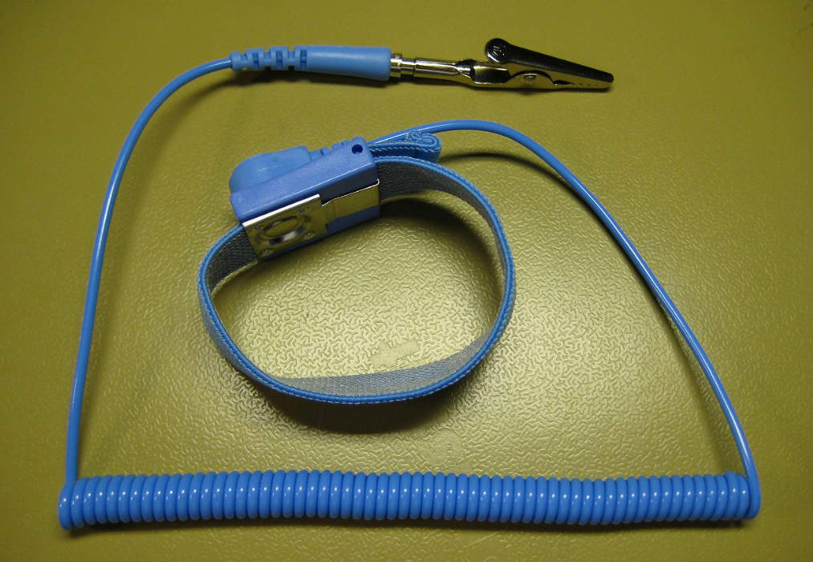{ width="300" }
  <figcaption></figcaption>
</figure>

Un **brazalete antiestático** o pulsera antiestática consiste en una cinta con un velcro para fijarla en la muñeca conectada a un cable de toma de tierra que permite descargar cualquier acumulación de electricidad estática que exista en el cuerpo de un operario.

<figure markdown>
  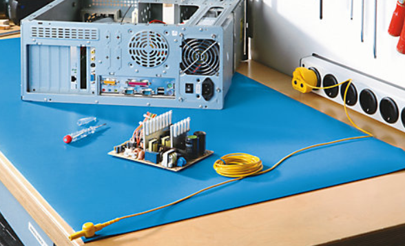{ width="300" }
  <figcaption></figcaption>
</figure>

Un **mantel antiestático** consiste en un mantel que se sitúa sobre la mesa de trabajo, el mantel está conectado a un cable de toma de tierra que permite descargar cualquier acumulación de electricidad estática que exista en el cuerpo de un operario.

#### ✂️ Alicates y pinzas
<figure markdown>
  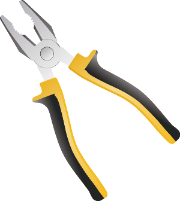{ width="300" }
  <figcaption></figcaption>
</figure>

Los **alicates** son herramientas imprescindibles para el trabajo de montajes electrónicos. Suele ser utilizada para múltiples funciones como sujetar elementos pequeños o cortar y modelar conductores.

Unas **pinzas de punta, o alicate puntiagudo**, es una herramienta de sujeción usada por electricistas y otros artesanos para doblar o reposicionar.

#### 🔦 Linterna

Una linterna eléctrica es un aparato portátil de iluminación que funciona mediante pilas o baterías eléctricas. Se usa para alumbrar zonas muertas de luz de la caja o gabinete. Suelen ser muy pequeñas, así caben en cualquier rincón de la caja o gabinete.

#### 🔎 Lupa

La lupa es un instrumento óptico que consta de una lente convergente de corta distancia focal, que desvía la luz incidente de modo que se forma una imagen virtual ampliada del objeto por detrás de una lupa. Una lente convergente puede conseguir que la imagen de un objeto se vea ampliada, y, por lo tanto, verla bajo un ángulo aparente mayor.

#### 📱 Multímetro
<figure markdown>
  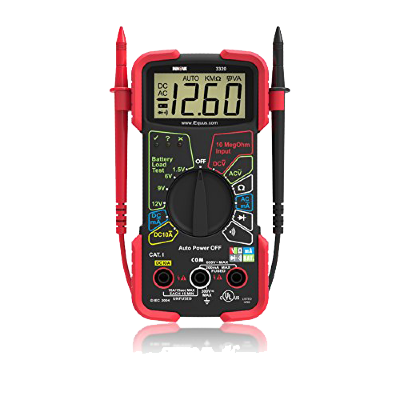{ width="200" }
  <figcaption></figcaption>
</figure>

Un multímetro, también denominado polímetro, tester o multitester, es un instrumento eléctrico portátil para medir directamente unas magnitudes eléctricas activas como corrientes y potenciales (tensiones) o pasivas como resistencias, capacidades y otras.

### ⚠️ Prevención de riesgos al manipular equipos

<figure markdown>
  { width="300" }
  <figcaption></figcaption>
</figure>

Cuando realizamos tareas de mantenimiento o procesos de montajes de equipos, hay elementos que generan, por sí mismos, un riesgo o peligrosidad que debemos tener presentes en el puesto de trabajo. La mayor parte proceden de la red eléctrica.

Para realizar estas tareas debemos tener presente el uso de los siguientes elementos de seguridad que debemos tener en cuenta:

**De las máquinas**: protecciones (por ejemplo contra la electricidad estática), alarmas, pasos de emergencia, entre otros.

**Individuales:** calzado, protección ocular, indumentaria adecuada, entre otros.

Otro factor que debemos tener en cuenta es la manipulación de materiales, herramientas y máquinas con las medidas de seguridad y protección personal requeridos.

Existen tres tipos de riesgos eléctricos que se nos pueden presentar cuando realizamos tareas de mantenimiento:

**Riesgo de choque eléctrico**: se produce cuando el cuerpo humano está sometido a una corriente eléctrica debido al tocar simultáneamente los dos polos eléctricos, bien directamente bien mediante un material conductor situado entre la corriente eléctrica y el cuerpo humano.

**Riesgo de incendio:** se origina cuando hay una excesiva intensidad en algún punto de la instalación o en un aparato eléctrico, por ejemplo un monitor.

**Riesgo de quemaduras:** se origina cuando el cuerpo humano está en contacto con una herramienta, por ejemplo un soldador.

Los riesgos de carácter físico que nos podemos encontrar, en el momento de la manipulación de los componentes que tienen los equipos, pueden ser de distinto carácter:

=== "Corte"
    <figure markdown>
        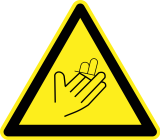
        <figcaption></figcaption>
    </figure>

    podemos sufrir cortes originados por el uso, de forma fortuita o negligente, de herramientas que tengan filo, sean punzantes y/o a través de elementos metálicos como chapas, chasis, etc. Inclusive de pequeños componentes o placas. Debemos tener en cuenta que, por ejemplo, en un ordenador debemos manipular componentes en espacios pequeños y es fácil rozarse con una tarjeta. En la imagen vemos una señal de peligro por corte.

    Para evitar cortes:

    - Observar la presencia de elementos punzantes y/o con bordes afilados, sin desbravar o puntiagudos.
    - Utilizar guantes adecuados, por ejemplo kevlar o de cuero, cuando se observe que existe la amenaza de corte o pinchazo.
    - Utilizar señalización de advertencia.

=== "Aplastamiento"
    <figure markdown>
        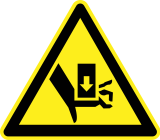
        <figcaption></figcaption>
    </figure>

    se pueden producir por caídas accidentales de "materiales pesados" como cajas de CPUs, monitores, impresoras, etc. Así como "pillarse" al cerrar o tapar una caja de ordenador, un monitor o al aproximarse, por ejemplo, un alicate cerca de los dedos. En la imagen vemos una posible señal de peligro de aplastamiento.

=== "Fuego"
    <figure markdown>
        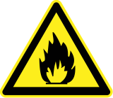
        <figcaption></figcaption>
    </figure>

    puede ser producido por choque eléctrico o producirse un incendio por calentamiento excesivo de componentes electrónicos. En la imagen vemos una señal de peligro de fuego

    Para evitar quemaduras:

    - No tocar componentes que lleven radiadores o disipadores de calor sin protección.
    - No tocar componentes con señales de pintura quemada.
    - No tocar resistencias de potencia sin estar previamente desconectada.
    - Averiguar, cuando se desprendan olores, qué componente lo produce.
    - Disponer de botiquín con geles o cremas adecuadas contra las quemaduras.
    - Utilización de señales de advertencia.

=== "Toxicidad"
    <figure markdown>
        
        <figcaption></figcaption>
    </figure>

    en el caso de componentes electrónicos estos pueden emitir vapores tóxicos. por ejemplo, si utilizamos un soldador, éste, al estar en contacto con el estaño, desprende un humo tóxico. En la imagen tenemos la señal típica de tóxicos.

    Para evitar absorber productos nocivos:

    - Identificar los componentes cancerígenos como siliconas, amiantos, etc.
    - Observar la existencia de componentes que contengan ácidos como baterías.
    - Identificar qué componentes o materiales puedan emitir vapores como las resinas de soldadura, etc.
    - Que el puesto de trabajo esté bien ventilado y disponer de agua en caso, por ejemplo, de contacto con algún producto tóxico.
    - El número de teléfono de emergencias debe estar disponible en todo momento.
    - Utilización de carteles de señalización.

=== "Eléctrico"
    <figure markdown>
        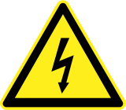
        <figcaption></figcaption>
    </figure>

    en un puesto de trabajo que se necesita, bien para la herramienta, bien para el producto que estamos manipulando, electricidad; el peligro de choque eléctrico siempre debe estar presente. En la imagen vemos la señal de peligro eléctrico.

    Para asegurarnos de la ausencia de tensión en los trabajos que se requieran, debemos:

    - Disponer de calzado aislado.
    - Evitar objetos metálicos en las manos.
    - Tener secas las manos y seca la ropa.
    - Desconectar la parte de la instalación en la que se va a realizar el trabajo. Por ejemplo, si manipulamos un ordenador, desconectar el cable de red eléctrica que alimenta la fuente de alimentación.
    - Prevenir cualquier retroalimentación. Cuando se desenchufa un componente electrónico, este aún puede contener carga eléctrica activa. Debemos esperar unos segundos para que le dé tiempo a descargarse.
    - Verificar la ausencia de tensión de todos los elementos activos de la instalación eléctrica en la zona de trabajo.
    - Utilizar equipos con desconexión.
    - Establecimiento de una señalización adecuada de seguridad.

---

Vamos a ver algunos ejemplos de precauciones que debemos respetar en el momento de utilización de algunas herramientas y máquinas comunes en un taller de mantenimiento:

**Alicates diversos:** existen tres clases diferentes de alicates: universales, de puntas y de corte, debes seleccionar el más apropiado para el trabajo que se pretende realizar. Como ejemplo citaremos:

- No emplearlas para aflojar o apretar tuercas y/o tornillos, se deforman las aristas.
- En caso de cortar un hilo metálico, hacerlo de forma perpendicular.
- Deben usarse con mangos aislados para protegernos de contactos eléctricos.
- Debemos coger la costumbre de abrirlo con el dedo meñique en lugar del índice, evitaremos que nos pillemos el dedo índice por estar próximo al punto de giro.
- Destornilladores: debemos siempre escoger el destornillador adecuado al tipo de tornillo que se deseamos apretar o aflojar, dependiendo de la hendidura de su cabeza (ranura, cruz, estrella, etc.) así como de su tamaño y profundidad. Cuando lo utilicemos de palanca (esto incluye a los alicates u otras herramientas) el trabajador debe alejarse lo más posible del lugar dónde se está aplicando dicha palanca.

**Soldador:** debemos tener en cuenta que la punta del soldador puede superar los 300ºC. Debemos mantenerla alejada del cuerpo, la ropa y los cables.

¿Cómo debemos realizar las tareas de montaje para no dañar el equipo?

Las descargas electrostáticas (ESD), las fuentes de alimentación en mal estado y las condiciones climáticas y ambientales pueden producir desastres en los ordenadores. Para evitar, en la medida de lo posible, daños en los equipos informáticos debemos seguir unas pautas para realizar la manipulación de los equipos de forma adecuada.

**¿Qué es la electricidad estática?** Es la acumulación de carga eléctrica en una superficie. La acumulación de este tipo de carga eléctrica puede dañar alguno de los componentes electrónicos de un equipo y, consecuentemente, dañarlo. Se conoce como carga electrostática.

**¿Cómo puede cargarse de electricidad estática?**

- Por rozamiento durante el transporte y/o manipulación.
- Al andar.
- Al rozar con plásticos y/o materiales aislantes.
- Al tocar circuitos cargados sin toma de tierra.

**¿Qué debemos hacer para proteger el equipo que manipulamos contra el ESD (descargas electrostáticas)?**

- La utilización de vestimenta adecuada: batas y zapatos antiestáticos.
- Realizaremos las tareas en bancos de trabajo protegidos. Debemos realizar las tareas en - alfombrillas con conexión a tierra.
- Los suelos deben ser antiestáticos.
- Los embalajes de los equipos deben estar construidos con material semiconductor.
- Los soldadores deben tener protección antiestática.
- Utilizaremos pulseras o guantes antiestáticos.

**Unos ejemplo para evitar las descargas electrostáticas:**

- Utilización de una pulsera antiestática en la apertura y montaje/desmontaje de una caja de ordenador para no dañar, sobre todo, a la placa base. La pulsera lleva una resistencia conectada en serie para limitar la corriente de cortocircuito, protegiendo al usuario por si tocara cualquier aparato o componente conectados a la red eléctrica. ¿Cómo se utiliza la pulsera? Se coloca en la muñeca de la mano con la que utilizaremos las herramientas. La pinza de la muñequera la pinzaremos sobre el chasis de la caja.

- Para la inserción de elementos electrónicos en la placa, por ejemplo la ampliación de bancos de memoria, utilizaremos guantes antiestáticos en la manipulación de los componentes electrónicos.

## 🧰 EJERCICIOS

1.- ❎ A través del programa  "Info center" de tu ordenador Lliurex, averigua la marca y el modelo de placa base que tiene el PC que estás usando y además describe lo siguiente

- Fabricante
- Modelo de PC
- Marca de la placa base
- Modelo de la placa base
- Adjunta el manual de usuario del PC en PDF
- Enumera todas las ranuras y zócalos que aparecen en el manual de usuario sobre la placa base (PCI, CPU, RAM [ Ranuras, máxima capacidad, Tipo de memoria, voltaje ])
- ¿Tiene interfaz IDE y SATA? ¿Cuántas?
- Interfaces soldadas en la placa base (audio, display port, vga...)

!!! DANGER "Cuidado"
    Adjunta capturas de pantalla con el modelo de la placa base y detalla cada uno de los elementos que existen en ella, enumerándolos y descríbelos abajo de la imagen.

    Sube a aules tanto el PDF del manual de usuario como el PDF de tus respuestas.

2.- ❎ Enumera y describe las partes de una semitorre por dentro y por fuera, recuerda que normalmente tienen un embellecedor en la parte de atrás con todas las conexiones disponibles de la placa base, enumera las más utilizadas:

- PS/2
- DVI, VGA, HDMI
- Ethernet
- Audio
- Fuente de alimentación y sus clavijas
- USB
- Puerto serie (COM)
- Puerto Paralelo

Puedes valerte de una imagen de algún PC de alguna tienda online como guía.