---
hide:
  - footer
---

# Sistemas Operativos
<figure markdown>
  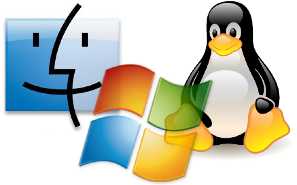{ width="400" }
  <figcaption></figcaption>
</figure>

En este tema veremos la diferencia que existe entre un sistema operativo y una distribución basada en un sistema operativo. Además, estudiaremos e instalaremos los diferentes sistemas y distribuciones que existen mediante la técnica de virtualización con un _software_ específico para ello.

Por otro lado, aprenderemos a manejar el sistema de particionado de discos (sobretodo en discos virtuales) y las distintas herramientas que vienen de serie en cada uno de los sistemas que vayamos a instalar.

## 📒 Vocabulario

??? INFO "Sistema anfitrión (Host)"
    Es el sistema operativo que se arranca cuando encendemos el ordenador original, el físico.

??? INFO "Sistema huésped (Guest)"
    Es el sistema operativo que se inicia a través de un _software_ de virtualización como **VirtualBox**

## 👩‍🚀 Virtualización
<figure markdown>
  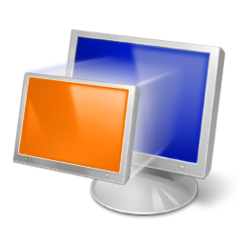{ width="200" }
  <figcaption></figcaption>
</figure>

Como ya sabemos lo que es un sistema operativo, vamos directamente a ver cómo podemos arrancar un sistema dentro de otro sistema operativo por medio de la técnica de virtualización.

La virtualización es una representación basada en software (es decir, virtual) de aplicaciones, servidores, almacenamiento y redes para reducir los gastos en la compra de equipos y aumentar la eficiencia y la agilidad.

La virtualización permite mejorar la agilidad, la flexibilidad y la escalabilidad de la infraestructura de TI, al mismo tiempo que proporciona un importante ahorro de costes. Algunas ventajas de la virtualización, como la mayor movilidad de las cargas de trabajo, el aumento del rendimiento y de la disponibilidad de los recursos o la automatización de las operaciones, simplifican la gestión de la infraestructura de TI y permiten reducir los costes de propiedad y operativos.

### 📦 Virtual Box

<figure markdown>
  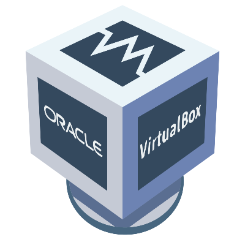{ width="250" }
  <figcaption></figcaption>
</figure>

VirtualBox es una aplicación que sirve para hacer máquinas virtuales con instalaciones de sistemas operativos. Esto quiere decir que si tienes un ordenador con Windows, GNU/Linux o incluso macOS, puedes crear una máquina virtual con cualquier otro sistema operativo para utilizarlo dentro del que estés usando.

En otras palabras, esto te va a permitir instalar otros sistemas operativos o el mismo que ya tienes dentro de tu ordenador. El primer caso te va a servir para probar las aplicaciones de otro sistema operativo para no tener que estar haciendo particiones o el proceso de instalar Linux junto a Windows.

#### 🔰 La pantalla principal

<figure markdown>
  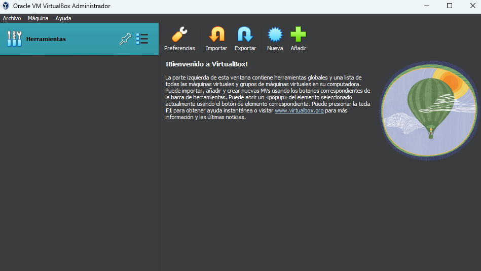{ width="600" }
  <figcaption></figcaption>
</figure>

Esta es la pantalla principal del programa ***Oracle VirtualBox*** donde nos muestra un resumen de las máquinas virtuales que hemos instalado en nuestro sistema anfitrión (_host_).

Conforme vayamos creando nuevas máquinas irán apareciendo en el menú de la izquierda, pudiendo seleccionar una o varias y configurando cada una de ellas, así como iniciarlas.

!!! ERROR "Cuidado"
    Sólo se permite correr una máquina virtual a la vez, debido a los recursos del sistema.

#### 💽 Medios virtuales _(CTRL + D)_

Los **medios virtuales** son los archivos de almacenamiento que se encuentran en el sistema anfitrión (host) y que pueden contener sistemas operativos en formato de **imagen de disco** o instalados.

Dichos archivos tienen varias características en función de qué tipo de medio virtual es

=== "Sistema Operativo instalado"
    Este tipo de medio virtual es un archivo con extensión **.vdi** que contiene en su interior un sistema operativo (como Windows o Linux) ya instalado.

    Por lo general puede estar confeccionado de 2 maneras diferentes:

    - **Espacio reservado dinámicamente:** A través del menú de configuración podremos especificar el tamaño máximo de este archivo (por ejemplo 20GB) pero ocupará lo que ocupe el sistema operativo instalado dentro de el. Conforme se vaya ocupando, el archivo en el ordenador anfitrión (host) irá aumentando.
    
    - **Espacio fijo:** A través del menú de configuración podremos especificar el tamaño máximo de este archivo (por ejemplo 20GB) y en el ordenador anfitrión (host) el archivo ocupará 20GB siempre, independientemente de si el sistema que está instalado dentro del archivo ocupa o no 20GB.

    !!! INFO
        En el mundo real (no virtual) son los discos duros (HDD) o SSD.

=== "Imagen de disco"
    Las imágenes de disco suelen servir para instalar un sistema operativo o para arrancarlo de manera directa sin instalar nada.

    Gracias a estos discos podremos instalar cualquier distribución de Linux o Windows.

    !!!INFO
        En el mundo real (no virtual) suelen ser los CDs o DVDs de instalación.

---

<figure markdown>
  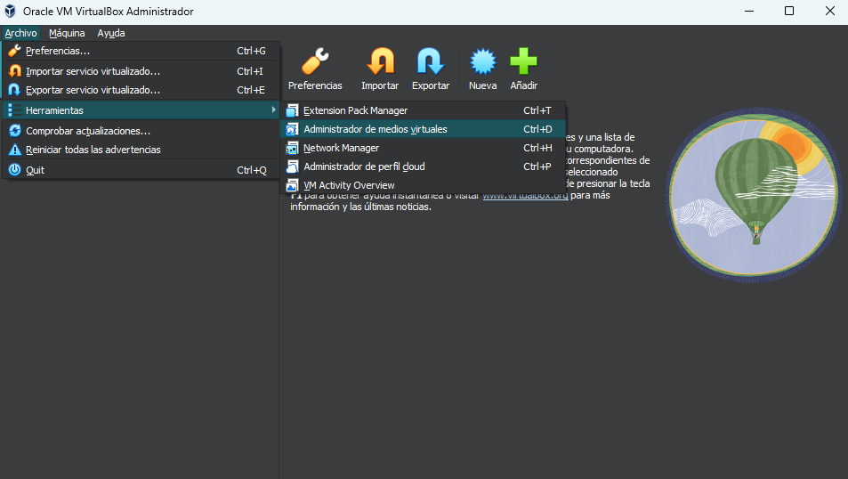{ width="600" }
  <figcaption></figcaption>
</figure>

Para añadir un medio virtual, abriremos el **Administrador de medios virtuales** dentro de **VirtualBox**

##### 💾 Disco Duro Virtual

Si queremos añadir un nuevo disco duro virtual para posteriormente instalar un sistema dentro de el, pincharemos sobre el icono de **Crear**, crearemos un archivo VDI y le asignaremos **tamaño dinámico**.

<figure markdown>
  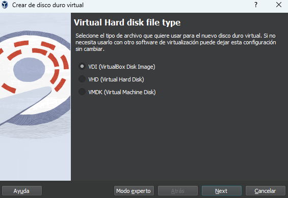{ width="400" }
  <figcaption>Seleccionamos VDI</figcaption>
</figure>

Seguidamente, indicaremos dónde queremos guardar este archivo (nuestro disco duro virtual) le asignaremos un nombre (normalmente el mismo nombre que el sistema que vayamos a instalar) y definiremos el tamaño (entre 15GB y 20GB)

<figure markdown>
  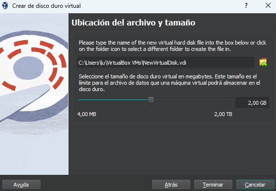{ width="400" }
  <figcaption>Ubicación, nombre y tamaño</figcaption>
</figure>

Una vez creado, aparecerá en la lista del gestor de medios virtuales de la siguiente manera

<figure markdown>
  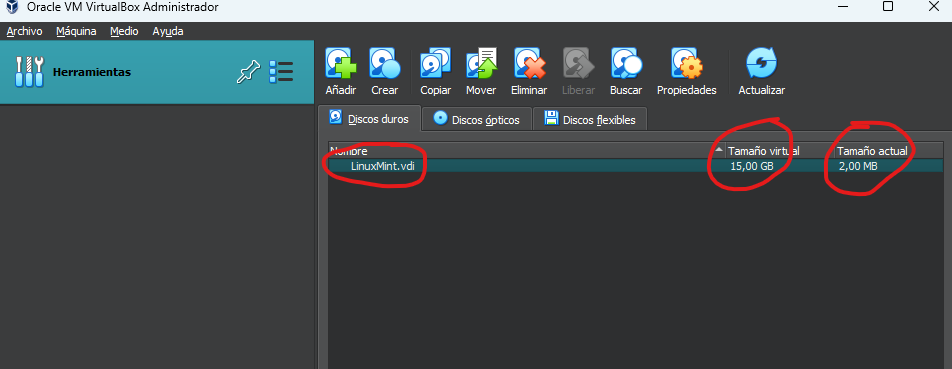{ width="400" }
  <figcaption>Discos virtuales</figcaption>
</figure>

##### 💿 Imagen de disco virtual

Para **añadir** una imagen de disco virtual (un instalador de sistema operativo) o archivo **.iso** primero de todo debemos descargar u obtener dicho archivo **iso** y después, en la pantalla de VirtualBox hay que apretar al botón de **Añadir**.

Vamos a trabajar con Linux Mint, así que descargaremos la última versión [desde este enlace](https://mirror.airenetworks.es/linuxmint/iso/stable/21/linuxmint-21-cinnamon-64bit.iso){target="_blank"} y una vez que tengamos el archivo descargado, deberemos agregarlo a la lista de discos a través del **Administrador de medios virtuales**

!!! WARNING "Ojo con ésto"
    Dentro del **Administrado de medios virtuales** debemos seleccionar la pestaña **Discos Ópticos** para poder añadir una imagen de disco.

<figure markdown>
  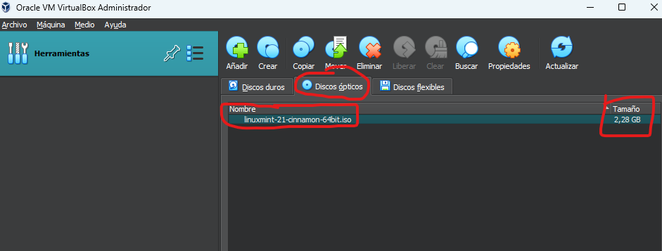{ width="400" }
  <figcaption>Imagen de disco virtual</figcaption>
</figure>

#### ⚙️ Configuración de la máquina _(CTRL + S)_
<figure markdown>
  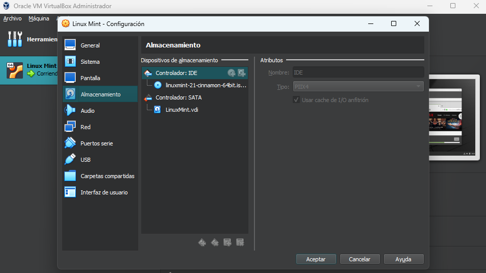{ width="600" }
  <figcaption>Configuración de la máquina virtual</figcaption>
</figure>

Para configurar una máquina virtual, la seleccionaremos de la lista de la izquierda y le daremos a configuración.

Para el ejemplo de clase vamos a trabajar con la siguiente configuración:

  - **Memoria RAM**: 4 GB
  - **Disco Duro Virtual**: LinuxMint.vdi
  - **Imagen de disco virtual**: linuxmint-21-cinnamon-64bit.iso
  - **Procesadores**: 4 (o 2 en caso de que no dispongamos de 4)
  - **Memoria de video**: 64MB

#### ▶️ Arrancando la máquina virtual
<figure markdown>
  { width="200" }
  <figcaption></figcaption>
</figure>

Ahora que ya lo tenemos todo, tan sólo nos queda arrancar al máquina virtual y empezar a instalar el sistema operativo definiendo particiones de disco, programas y funcionalidades que se van a instalar, usuario y contraseña, localización, idioma entre otras.

Recuerda que cada instalador tiene su propio menú con diferentes opciones pero que algunas, como es el caso del particionado de discos es común a todos los sistemas operativos.

Más adelante veremos cómo particionar el disco correctamente para poder tener albergados varios sistemas operativos en un mismo archivo de almacenamiento virtual o **.VDI**

## 🪛 Herramientas de control de archivos

<figure markdown>
  { width="400" }
  <figcaption></figcaption>
</figure>

Ya sabemos instalar sistemas operativos, tanto en local como en una máquina virtual, vamos a ver más en profundidad las herramientas esenciales que brinda cada sistema operativo.

### 💁 Usuarios y roles

<figure markdown>
  { width="400" }
  <figcaption></figcaption>
</figure>

Todos los sistemas operativos disponen de una gestión de usuarios.

Los usuarios tienen permisos determinados en función de un rol asignado. Dependiendo del sistema operativo tenemos unos roles u otros.

#### 💻 Roles en Windows

<figure markdown>
  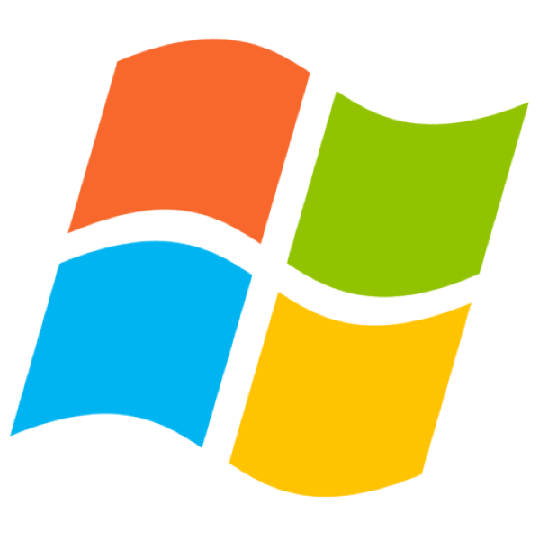{ width="300" }
  <figcaption></figcaption>
</figure>

En Windows, existen varios roles de usuario con diferentes niveles de acceso y privilegios. Algunos de los roles de usuario más comunes son:

**Usuario**: Es el rol predeterminado para la mayoría de los usuarios. Los usuarios tienen acceso a sus propios archivos y carpetas, pero no pueden realizar cambios en el sistema.

**Administrador**: Los usuarios con este rol tienen acceso completo al sistema y pueden realizar cambios en configuraciones y aplicaciones.

**Usuario de red**: Los usuarios con este rol tienen acceso limitado al sistema y pueden conectarse a una red, pero no pueden instalar aplicaciones ni realizar cambios en configuraciones.

**Usuario de invitado**: Los usuarios con este rol tienen acceso limitado al sistema y no pueden realizar cambios en configuraciones. Es utilizado para proporcionar acceso temporal a un usuario desconocido.

**Usuario de control de cuentas de usuario (UAC)**: El Usuario de control de cuentas de usuario es un rol de seguridad en el sistema operativo Windows desde Windows vista y posteriores, que limita el acceso y los cambios del sistema solo a usuarios administradores.

!!! WARNING "Atención"
    Los roles de usuario se utilizan para controlar quién tiene acceso a qué funciones del sistema y para garantizar la seguridad del sistema operativo. Es importante asignar a los usuarios el rol adecuado y configurar las políticas de seguridad de forma adecuada para proteger el sistema operativo.

#### 🖥️ Roles en Linux

<figure markdown>
  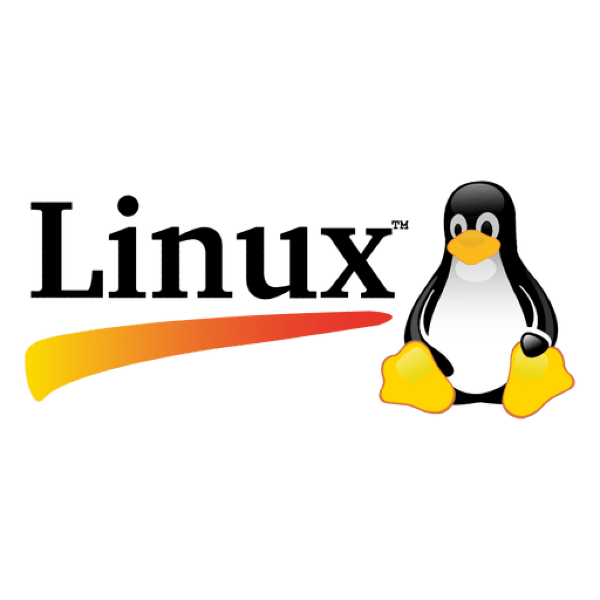{ width="300" }
  <figcaption></figcaption>
</figure>

En Linux, también existen varios roles de usuario con diferentes niveles de acceso y privilegios. Algunos de los roles de usuario más comunes son:

**Usuario**: Es el rol predeterminado para la mayoría de los usuarios. Los usuarios tienen acceso a sus propios archivos y carpetas, pero no pueden realizar cambios en el sistema.

**Root**: El usuario root es el usuario con acceso completo al sistema y puede realizar cambios en configuraciones y aplicaciones. Es el superusuario, y tiene acceso a todo el sistema, incluyendo todos los archivos y configuraciones.

**Usuario de sistema**: Los usuarios con este rol son los usuarios necesarios para el correcto funcionamiento del sistema, y suelen tener acceso limitado a algunos recursos del sistema

**Usuario de red**: Los usuarios con este rol tienen acceso limitado al sistema y pueden conectarse a una red, pero no pueden instalar aplicaciones ni realizar cambios en configuraciones.

**Usuario de invitado**: Los usuarios con este rol tienen acceso limitado al sistema y no pueden realizar cambios en configuraciones. Es utilizado para proporcionar acceso temporal a un usuario desconocido.

!!! ERROR "Recuerda"
    Los roles de usuario se utilizan para controlar quién tiene acceso a qué funciones del sistema y para garantizar la seguridad del sistema operativo. Es importante asignar a los usuarios el rol adecuado y configurar las políticas de seguridad de forma adecuada para proteger el sistema operativo. Es importante también recordar que en sistemas Linux, es recomendable evitar usar el usuario root para tareas diarias, ya que al tener acceso completo al sistema, un mal uso puede causar daños graves.

### 👩‍💼 Permisos y control de directorios

Quizás no estemos tan familiarizados con este tema pero, en sistemas operativos basados en Unix o Linux (si, Macintosh está basado en Unix) el tema de los permisos es algo fundamental a la hora de gestionar el sistema operativo y los archivos que lo conforman.

Existen diferentes herramientas de control de directorios y gestión de permisos disponibles en diferentes sistemas operativos. Algunas de ellas son:

- **chmod**: Es una herramienta de línea de comandos en sistemas operativos basados en Unix, como Linux y macOS, que se utiliza para cambiar los permisos de acceso a archivos y carpetas.

- **chown**: Es otra herramienta de línea de comandos en sistemas operativos basados en Unix que se utiliza para cambiar el propietario de un archivo o carpeta.

- **icacls**: Es una herramienta de línea de comandos en sistemas operativos Windows que se utiliza para modificar los permisos de acceso a archivos y carpetas.

- **Interfaz gráfica de usuario (GUI)**: La mayoría de los sistemas operativos tienen una interfaz gráfica de usuario que permite a los usuarios gestionar los permisos de acceso a archivos y carpetas de manera más sencilla. Por ejemplo, en Windows, se pueden cambiar los permisos de acceso a través del Explorador de archivos, mientras que en macOS se pueden cambiar los permisos de acceso a través del Finder.

#### En Windows

En Windows, cada archivo y carpeta tiene permisos de acceso asociados a diferentes usuarios y grupos de usuarios. Estos permisos pueden ser modificados utilizando el administrador de archivos de Windows o la línea de comandos con el comando **icacls**. Los permisos pueden ser configurados para permitir o denegar acceso a lectura, escritura y ejecución, así como para controlar el acceso a características específicas como el cambio de nombre o eliminación de un archivo o carpeta.

##### A través de la Interfaz Gráfica de Usuario (GUI)

Gracias a las **Herramientas Administrativas** de nuestro sistema Windows podemos gestionar los grupos y usuarios que existen en el equipo.

<figure markdown>
  { width="600" }
  <figcaption></figcaption>
</figure>

#### En Linux

En Linux, cada archivo y directorio tiene permisos de lectura, escritura y ejecución asociados a tres grupos de usuarios: el propietario del archivo, el grupo del propietario y otros usuarios. Los permisos se pueden ver y modificar mediante el comando chmod. El comando ls -l también muestra los permisos actuales de un archivo o directorio.

En Lliurex, una distribución de Linux basada en Ubuntu, se pueden cambiar los permisos de un archivo o carpeta utilizando la interfaz gráfica de usuario (GUI) de manera similar a como se hace en Ubuntu.

Una forma de hacerlo es utilizando el administrador de archivos Nautilus:

- Abrir el administrador de archivos Nautilus.
- Buscas el archivo o carpeta que desea cambiar.
- Clic con el botón derecho del mouse sobre el archivo o carpeta.
- Seleccionamos "Propiedades" en el menú desplegable.
- En la pestaña "Permisos" podrás ver y editar los permisos de lectura, escritura y ejecución para el propietario, el grupo y otros usuarios.
- Otra forma es utilizando el comando **chmod** en la terminal, el cual te permite cambiar los permisos de forma mas precisa y rapidamente.

### Control de directorios

El sistema gestiona archivos y directorios de una manera eficaz y segura pero, es nuestro trabajo que todo esté en su sitio o establecer un patrón de organización a la hora de almacenar la información.

Si tenemos una carpeta que contiene imágenes, a esta carpeta la podemos llamar **imágenes** y no **patatas** o cualquier otra cosa que no tenga nada que ver con el contenido.

Lo mismo pasa con los subdirectorios, debemos organizarlos con lógica para que luego, a la hora de buscar contenido sea más fácil de encontrarlo.

Algunas herramientas comunes de control de estructura de directorios y gestión de permisos en Lliurex son:

- **chmod**: permite cambiar los permisos de un archivo o directorio.
- **chown**: permite cambiar el propietario y el grupo propietario de un archivo o directorio.
- **ls**: permite listar los archivos y directorios en una ruta específica, mostrando información sobre sus permisos y propietarios.
- **mkdir**: permite crear un nuevo directorio.
- **rmdir**: permite eliminar un directorio vacío.
- **find**: permite buscar archivos y directorios en una ruta específica, utilizando diferentes criterios de búsqueda (por ejemplo, por nombre, por permisos, por fecha de modificación).

Es importante tener en cuenta que estas herramientas deben ser utilizadas con precaución, ya que cambios malintencionados en los permisos o propietarios de archivos y directorios pueden causar problemas en el sistema.

## Errores en la Fase de arranque

Hay varios posibles fallos que pueden ocurrir en la fase de arranque de un equipo microinformático. Algunos de los más comunes incluyen:

- **Error de arranque**: el sistema operativo no se inicia correctamente, lo que puede deberse a un problema con el sistema de arranque o un fallo en el hardware.

- **Problemas de configuración**: el sistema no puede acceder a la configuración necesaria para iniciarse, como el sistema de archivos o la configuración de red.

- **Problemas de hardware**: el sistema no puede detectar o acceder a ciertos componentes del hardware, como la unidad de disco duro o la memoria.

- **Problemas de software**: el sistema no puede iniciar debido a un problema con un programa o controlador, o debido a un virus o malware.

- **Problemas de inicio**: el sistema se queda en un bucle de arranque o no puede iniciarse debido a un problema con el arranque dual o la configuración de la BIOS.

!!! ERROR "Cuidado!"
    Es importante tener en cuenta que estos son solo algunos ejemplos generales, y que pueden existir muchas otras causas para los problemas de arranque. Además, es importante investigar cual es la causa específica del fallo y abordarlo de manera adecuada.

## Copias de seguridad

Las copias de seguridad son una medida importante para proteger los datos de un equipo microinformático contra fallos o pérdidas de datos. Al realizar copias de seguridad, se crea una copia de los datos importantes en un dispositivo de almacenamiento externo, como un disco duro externo o una unidad flash USB.

Hay varias opciones disponibles para realizar copias de seguridad de los datos. Algunas de las opciones más comunes incluyen:

- **Copias de seguridad manuales**: los usuarios pueden copiar y pegar manualmente los datos importantes en un dispositivo de almacenamiento externo.

- **Copias de seguridad automáticas**: algunos programas de software permiten programar las copias de seguridad para que se realicen de forma automática en una fecha y hora específicas.

- **Copias de seguridad en línea**: algunos servicios en línea permiten realizar copias de seguridad de los datos en un servidor remoto, lo que ofrece una mayor seguridad en caso de pérdida de datos.

- **Copias de seguridad incremental**: estas copias de seguridad solo copian los cambios realizados en los archivos desde la última copia de seguridad, lo que permite ahorrar espacio y tiempo.

!!! WARNING "Cuidado..."
    Es importante asegurarse de que las copias de seguridad estén actualizadas y se almacenen en un lugar seguro y accesible. Es recomendable realizar copias de seguridad con cierta frecuencia, para asegurar que los datos estén siempre actualizados.

---

## 🧰 EJERCICIOS

1.- ❎ Instala Linux Mint creando los medios virtuales que necesites para llevarlo a cabo. Recuerda que el disco duro virtual debe ocupar entre 15GB y 20GB.

---

2.- ❎ Instala las ***Guest Additions*** de Virtual Box para poder tener la pantalla completa en la máquina virtual.

---

3.- ❎ Instala el programa **Visual Studio Code** mediante el gestor de paquetes de Linux Mint.

---

4.- ❎ Investiga todos las distribuciones de Linux de la siguiente lista y haz un resumen de cada una de ellas **mínimo 100 palabras** por cada distribución, añadiendo su logotipo al texto.

    - Ubuntu
    - Pop!_OS
    - Zorin OS
    - Elementary OS
    - Gentoo
    - Manjaro
    - Kali Linux
    - Arch Linux
    - Tiny Core
    - Kubuntu

5.- ❎ Elige una de las distribuciones que más te ha gustado de la lista anterior y **crea una máquina virtual** con dicho sistema. Acuérdate que como máximo tienes que crear un disco duro virtual de entre 15 y 20 gigas de espacio que vaya aumentando de manera dinámica.

---

6.- ❎ ¿Qué es un sistema de ficheros y cuántos existen? ¿cuáles son las limitaciones de cada uno de ellos? ¿en qué sistema operativo podemos encontrarlos? Elabora un documento recogiendo los sistemas de ficheros más utilizados en los 3 grandes Sistemas Operativos; Windows, OSx y Linux (cualquier distribución sirve)

    - FAT
    - FAT16
    - FAT32
    - NTFS
    - HPF
    - HFS+
    - exFAT
    - ext
    - ext2
    - ext3
    - ext4

---

7.- ❎ Busca en Internet una imagen de Windows (como mínimo la versión 7 y máximo la 10) descárgala y prepara una nueva máquina virtual para instalar dicho sistema operativo

---

8.- ❎ Crea al menos 3 usuarios diferentes en la máquina virtual de Windows que acabas de instalar. Recuerda que cada usuario puede tener un rol diferente. Busca información en Internet de cómo crear usuarios y asignar roles distintos. Elabora un documento de cómo se hace dicha tarea, además, aporta capturas de pantalla con los usuarios creados. En el mismo documento, pon la lista de usuarios que has creado junto con el rol y la contraseña de cada uno. **No olvides subir el PDF a Aules**.

---

9.- Haz lo mismo que en el ejercicio 6 pero con otra imagen de Linux que no hayas instalado ya.

---

10.- Haz lo mismo que en el ejercicio 8 pero con la imagen de Linux que has instalado en el ejercicio 9.