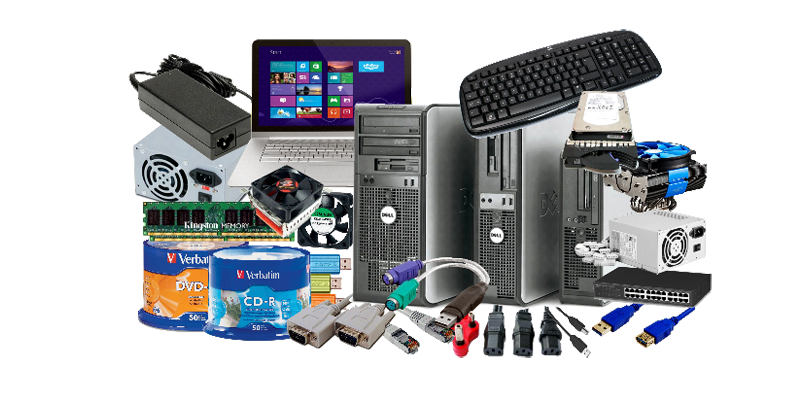

---
hide:
  - footer
---

# Bienvenid@s a Montaje y mantenimiento de sistemas y componentes informáticos

En esta asignatura veremos las tripas a los ordenadores, como funcionan por dentro los distintos aparatos electrónicos que lo componen, cómo se comunica el **_software_** con el **_hardware_** mediante diferentes sistemas operativos y el mantenimiento necesario para todo un sistema informático.

<figure markdown>
  { width="500" }
  <figcaption></figcaption>
</figure>

!!! NOTE "Tema 1 ~ MONTAJE Y MANTENIMIENTO DE SISTEMAS INFORMÁTICOS"
    - Se han descrito las operaciones y comprobaciones previas a la manipulación segura de componentes eléctricos y/o electrónicos
    - Se han identificado los dispositivos y herramientas necesarios en la manipulación segura de sistemas electrónicos
    - Se han seleccionado las herramientas necesarias para el procedimiento de montaje, sustitución o conexión de componentes hardware de un sistema microinformático
    - Se han identificado funcionalmente los componentes hardware para el ensamblado y/o mantenimiento de un equipo microinformático
    - Se han descrito las características técnicas de cada uno de los componentes hardware (internos y externos) utilizados en el montaje y/o mantenimiento de un equipo microinformático
    - Se han localizado los bloques funcionales en placas bases utilizadas en los sistemas microinformáticos
    - Se han identificado los tipos de puertos, bahías internas y cables de conexión (de datos y eléctricos, entre otros) existentes de un equipo microinformático
    - Se han seguido las instrucciones recibidas

    ??? QUESTION "Desglose"
        - Elementos básicos: Pilas y baterías, pulsadores, interruptores, fuentes de alimentación, resistencias, condensadores, diodos, transistores, led, entre otros
        - Herramientas utilizadas en los procedimientos de montaje de componentes y periféricos informáticos
        - Unidades funcionales de un sistema informático
        - Componentes de los sistemas microinformáticos: tipos de carcasas, fuentes de alimentación, ventiladores y disipadores de calor
        - La placa base Microprocesadores, zócalos y tipos Memorias RAM, características y formatos
        - Buses y conectores de datos
        - Cableado y conectores de potencia
        - Zócalos y bahías de expansión
        - Dispositivos de almacenamiento: discos duros, características y tipos; Lectores/grabadores ópticos y magneto-ópticos, características y tipos
        - Puertos: paralelo, serie, USB (Bus de Serie Universal), «Firewire» (IEEE 1394), entre otros
        - Seguridad en el uso de herramientas y componentes eléctricos y electrónicos
        - Seguridad eléctrica: medidas de prevención de riesgos eléctricos; daños producidos por descarga eléctrica

!!! TLDR "Tema 2 ~ ENSAMBLAJE DE COMPONENTES HARDWARE DE UN EQUIPO MICROINFORMÁTICO"
    - Se ha comprobado cada componente antes de su utilización, siguiendo las normas de seguridad establecidas
    - Se han interpretado las guías de instrucciones referentes a los procedimientos de integración o ensamblado, sustitución y conexión del componente hardware de un sistema microinformático
    - Se han reconocido en distintas placas base cada uno de los zócalos de conexión de microprocesadores y los disipadores, entre otros
    - Se han ensamblado los componentes hardware internos (memoria, procesador, tarjeta de video, pila, entre otros) en la placa base del sistema microinformático
    - Se ha fijado cada dispositivo o tarjeta en la ranura o bahía correspondiente, según guías detalladas de instalación
    - Se han conectado adecuadamente aquellos componentes hardware internos (disco duro, DVD, CD-ROM, entre otros) que necesiten cables de conexión para su integración en el sistema microinformático

    ??? QUESTION "Desglose"
        - Procedimientos de instalación y fijación de componentes microinformático a la carcasa y a la placa base
        - Periféricos básicos: monitor, teclado, ratón e impresoras
        - Otros periféricos: altavoces, micrófono, escáner, dispositivos multimedia, entre otros
        - Técnicas de montaje, sustitución y conexión de componentes y periféricos microinformáticos Las guías de montaje
        - La Seguridad en las operaciones de montaje, sustitución y conexión de componentes y periféricos microinformáticos

!!! INFO "Tema 3 ~ INSTALACIÓN DE SISTEMAS OPERATIVOS"
    - Se han descrito los pasos a seguir para la instalación o actualización
    - Se ha verificado la ausencia de errores durante el proceso de carga del sistema operativo
    - Se han utilizado las herramientas de control para la estructura de directorios y la gestión de permisos
    - Se han instalado actualizaciones y parches del sistema operativo según las instrucciones recibidas
    - Se han realizado copias de seguridad de los datos
    - Se han anotado los posibles fallos producidos en la fase de arranque del equipo microinformático
    - Se han descrito las funciones de replicación física («clonación») de discos y particiones en sistemas microinformáticos
    - Se han utilizado herramientas software para la instalación de imágenes de discos o particiones señalando las restricciones de aplicación de las mismas
    - Se ha verificado la funcionalidad de la imagen instalada, teniendo en cuenta el tipo de «clonación» realizada

    ??? QUESTION "Desglose"
        - El software básico de un sistema informático
        - Funciones del sistema operativo
        - Utilización del sistema operativo
        - Sistemas operativos actuales
        - Operaciones con el sistema de archivos, directorios y permisos
        - Herramientas de creación e implantación de imágenes y réplicas de sistemas: orígenes de información; procedimientos de implantación de imágenes y réplicas de sistemas; procedimientos de verificación de imágenes y réplicas de sistemas

!!! TIP "Tema 4 ~ FUNCIONALIDAD DE LOS SISTEMAS"
    - Se ha aplicado a cada componente hardware y periférico el procedimiento de testeo adecuado
    - Se ha verificado que el equipo microinformático realiza el procedimiento de encendido y de POST (Power On Self Test), identificando el origen de los problemas, en su caso
    - Se ha comprobado la funcionalidad de los soportes para almacenamiento de información
    - Se ha verificado la funcionalidad en la conexión entre componentes del equipo microinformático y con los periféricos
    - Se han utilizado herramientas de configuración, testeo y comprobación para verificar el funcionamiento del sistema
    - Se han utilizado las herramientas y guías de uso para comprobar el estado de los soportes y de la información contenida en los mismos
    - Se han registrado los resultados y las incidencias producidas en los procesos de comprobación

    ??? QUESTION "Desglose"
        - Técnicas de verificación y testeo de sistemas microinformáticos
        - Software de testeo y verificación
        - Herramientas de verificación y diagnóstico de sistemas microinformáticos
        - Procedimientos de POST (Power-On Self Test)
        - Conexión de dispositivos periféricos en el sistema microinformático

!!! CHECK "Tema 5 ~ MANTENIMIENTO BÁSICO DEL EQUIPO Y PERIFÉRICOS"
    - Se ha comprobado por medio de indicadores luminosos, que los periféricos conectados tienen alimentación eléctrica y las conexiones de datos
    - Se han descrito los elementos consumibles necesarios para ser utilizados en los periféricos de sistemas microinformáticos
    - Se han utilizado las guías técnicas detalladas para sustituir elementos consumibles
    - Se han descrito las características de los componentes, de los soportes y de los periféricos para conocer los aspectos que afecten a su mantenimiento
    - Se han utilizado las guías de los fabricantes para identificar los procedimientos de limpieza de componentes, soportes y periféricos
    - Se ha realizado la limpieza de componentes, soportes y periféricos respetando las disposiciones técnicas establecidas por el fabricante manteniendo su funcionalidad
    - Se han recogido los residuos y elementos desechables de manera adecuada para su eliminación o reciclaje

    ??? QUESTION "Desglose"
        - Técnicas auxiliares de mantenimiento de sistemas microinformáticos: El mantenimiento preventivo y periódico
        - Medidas de conservación y reciclaje de elementos consumibles
        - Procedimientos de sustitución de elementos consumibles
        - Seguridad en la manipulación y sustitución de elementos consumibles

!!! DANGER "Tema 6 ~ ALMACENAJE DE EQUIPOS, PERIFÉRICOS Y CONSUMIBLES"
    - Se han descrito las condiciones para manipular, transportar y almacenar componentes y periféricos de un sistema microinformático
    - Se han identificado los tipos de embalaje para el transporte y/o almacenaje de cada dispositivo, periférico y consumible
    - Se han utilizado las herramientas necesarias para realizar las tareas de etiquetado previas al embalaje y/o almacenamiento de sistemas, periféricos y consumibles
    - Se han utilizado los medios auxiliares adecuados a los elementos a transportar
    - Se han aplicado las normas de seguridad en la manipulación y el transporte de elementos y equipos
    - Se ha comprobado que los componentes recepcionados se corresponden con el albarán de entrega y que se encuentran en buen estado
    - Se han registrado las operaciones realizadas siguiendo los formatos establecidos
    - Se han recogido los elementos desechables para su eliminación o reciclaje

    ??? QUESTION "Desglose"
        - Técnicas de etiquetado, embalaje, almacenamiento y traslado de sistemas y componentes informáticos
        - Procedimientos y herramientas de etiquetado
        - Embalaje de componentes y periféricos de un sistema microinformático
        - Precauciones a considerar en el traslado de sistemas microinformáticos
        - Tratamiento, reciclaje y eliminación de residuos informáticos